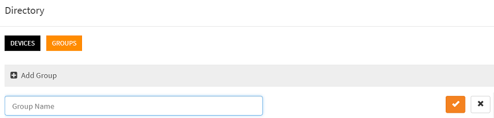

# How to create groups of devices or groups of users?

You can create groups of devices and users in two different ways:
- From the workspace, using the visual tools
- Dynamically from the code (scripts)

## Create groups from the workspace

Sign-in to your [workspace](https://www.scriptr.io/workspace), click on your username in the top-right corner of the screen, 
then  click on **Device Directory**


*Image 1*

- Click on the Groups Tab
- Click on +Add Group
- Enter a name for the new group
- Enter a optional description
- Click on the check sign



*Image 2*

## Create groups dynamically from the code

From within a script in the [workspace](https://www.scriptr.io/workspace), you need to require the **group** module and invoke its **create()** method passing the group name. 

```
var group = require("group");
var resp = group.create("iot_devices");
return resp;
```

- The object returned by create() contains a metadata section 
- If successful, metadata.status will be set to "success"
- If create() fails, metadata.status will be set to "failure" 

```
// successful create (example)
 {
  "metadata": {
    "status": "success"
 }
    
// unsuccessful create (example)
 {
  "metadata": {
    "status": "failure"
 }
```
