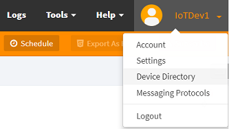
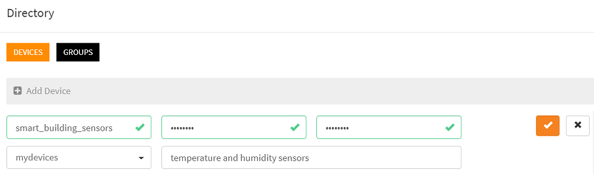

# How to create devices and users in my account?

You can create devices and users in two different ways:
- From the workspace, using the visual tools
- Dynamically from the code (scripts)

## Create device/users from the workspace

Sign-in to your [workspace](https://www.scriptr.io/workspace), click on your username in the top-right corner of the screen, 
then  click on **Device Directory**



*Image 1*

- Click on +Add Device
- Enter values for the mandatory device id and password fields
- Optionally, you can optionally, you can assign the device to groups (the device will inherit from all the authorizations of the selected groups)
- Enter a optional description
- Click on the check sign



*Image 2*

Scriptr.io automatically generates and authentication token for the newly created device. 
This token can be used to authenticate http requests and web socket messages sent to your APIs.

## Create devices dynamically from the code

From within a script in the [workspace](https://www.scriptr.io/workspace), you need to require the **device** module and invoke its **create()** method passing the necessary data. If you do not specify an "id", scriptr.io will create one automatically.

```
var device = require("device");
var deviceData = {
    
    name: "Multitech Conduit 001",
    password: "some_password",
    groups: "mydevices" // optional
};

var resp = device.create(deviceData);
return resp;
```
- The object returned by create() contains a metadata section and a result section
- If successful, metadata.status will be set to "success" and result.device.id will contain the device's identifier
- If create() fails, metadata.status will be set to "failure" and no result is returned
```
// successful create (example)
{
	"result": {
		"device": {
			"id": "T7256996A7"
		}
	},
	"metadata": {
		"status": "success"
	}
}

// unsuccessful create (example)
 {
	"metadata": {
		"status": "failure",
		"statusCode": 400,
		"errorCode": "INVALID_IDENTIFIER",
		"errorDetail": "The device [T7256996A7] is invalid."
	}
}
```
**ATTENTION** invoking device.create() will not automatically generate a token for the created device. You have to ask for generating a token yourself using **device.generateToken(deviceId)**

```
var device = require("device");
devices.generateToken("T7256996A7"); 
```

## Update a device dynamically from the code

Simply use the **update()** function of the **device** module, passing a structure containing the device id and the fields to update.
```
var device = require("device");
var deviceData = {
    id: "T7256996A7",
    name: "Multitech Conduit 001",
    password: "some_password",
    groups: "authorized_devices" // puts the device into a new group
};

var resp = device.update(deviceData);
return resp;```
```
# More

Learn more about the device module in our [documentation](https://www.scriptr.io/documentation#documentation-device-moduledeviceModule)
