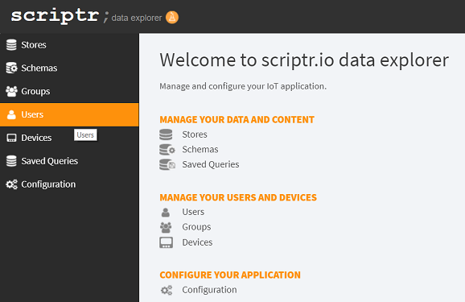
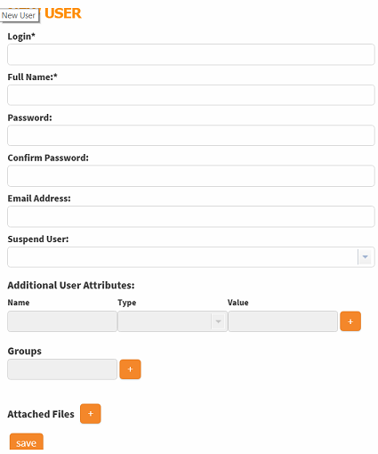

# How to create users in my account?

You can create users in two different ways:
- Using the [Data Explorer](https://www.scriptr.io/dataexplorer)
- Dynamically from the code (scripts)

## Create a user

Sign-in to your [workspace](https://www.scriptr.io/workspace), click on **Tools** in the menu bar at the top of the screen, then select **Data Explorer**



*Image 1*

- Click on Users then click on Save User to create a new user
- Fill the the form fields by entering the user's name, the user's login and his password

Notice that script allows you to add your own custom fields. You can also attach files, which is convenient to add a picture of the user for example.



*Image 2*

Once done, click on the **Save** button to persist your changes. You can visualize your users by clicking on **List Users**. 
Selecting a user on the list allows you to view the user's details.

## Create users dynamically from the code

From within a script in the [workspace](https://www.scriptr.io/workspace), you need to require the **user** module.

```
var user = require("user");
```

This module offers many convenient methods to manipulate user object. For now, we'll resort to its **create()** method create a new user, based on some fictitious data.
As shown in the example below, you need to provide the following mandatory parameter:

- **id**, which uniquely identify your user. As a rule of thumb, you can always pass an email address,
- **password**: the password associated to the id
- **name**: the full name of the user

```
var user = require("user");
var userData = {
    
  	id: "john@acme.com", // mandatory field
    name: "john doe",
    password: "j0HN@AcmE"
};

var resp = user.create(userData);
```

- The object returned by create() contains a metadata section 
- If successful, metadata.status will be set to "success"
- If create() fails, metadata.status will be set to "failure" 

```
// successful create (example)
 {
  "metadata": {
    "status": "success"
 }
    
// unsuccessful create (example)
 {
  "metadata": {
    "status": "failure"
 }
```

# More

Learn more about the user module from our [documentation](https://www.scriptr.io/documentation#documentation-user-moduleuserModule)
