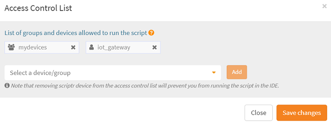
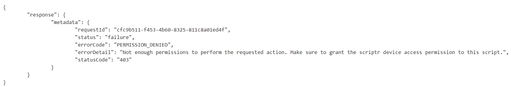

# How do I restrict access to my API?

Scripts are the main components of any scriptr.io application. By default, any script you write is automatically deployed as a secure and scalable API. All scripts are written in standard JavaScript, deployed and ran on the back-end.

*You might want to check [How to create a secure and scalable API?](https://github.com/scriptrdotio/howto/blob/master/api/create_api.md)*

## Define authorizations

By default, a script is ony accesible to entities (users, devices) that are authenticated by your scriptr.io account, thus scriptr.io always makes sure that your APIs are not accessed by unauthorized parties. This is visually expressed by the small red lock that appears on the right of the script editor in your [workspace](https://www.scriptr.io/workspace)

*Image 1*

If you take a closer look by clicking on the lock, this opens an **Access Control List (ACL)** editor. As you can see, access to the script is by default only to the owners **authenticated** role, i.e. any user or device created from your account.

*Image2*

You can modify this ACL by selecting a device, a user, a role or a group from the drop down list, then by clicking "Add". You can repeat this process as many times as needed, then validate your changes by clicking on "Save changes".

*Image3*

In the above example, the authorization to execute the script is limited to all members of the "mydevices" group and to the "iot_gateway" device.

Permissions are instantaneously effective. You can try this by clicking "run" from the IDE and you will notice that scriptr.io will deny you the authorization to remotely execute the script if you are not part of the ACL.

*Image4*

