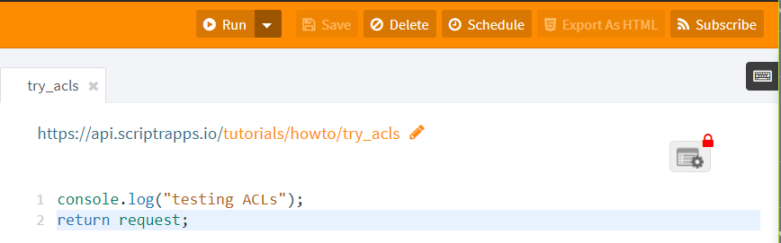
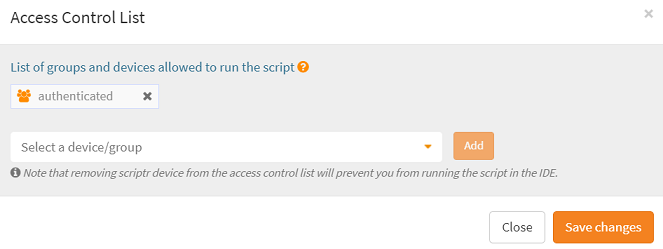
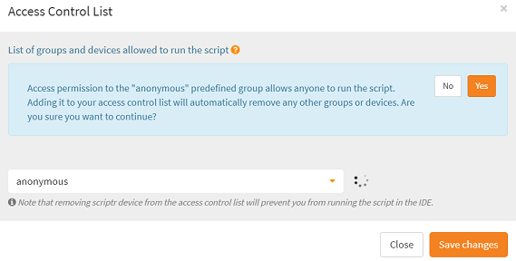

# How to give remote clients anonymous access to my API?

It is very simple to grant remote resources unrestricted access to your API (scripts), i.e. without requiring from them to provide an authentication token. In order to do that, you need to just need to switch the ACL of the script to **Anonymous**

## Switching the ACL of a script to Anonymous

Click on the small red lock that appears on the right of the script editor in your [workspace](https://www.scriptr.io/workspace)

**Image 1**

Clicking on the lock opens an **Access Control List (ACL)** editor. As you can see, access to the script is granted by default only to the built-in **authenticated** role, i.e. any user or device created from your account.

*Image 2*

Modify this ACL by searching for the **anonymous** built-in role, then by clicking "Add". Acknowledge scriptr's message regarding switching to this role (cick "yes") and click on "Save Changes" to validate your choice, then click on "Close" to go back to the script.  

*Image 3*

As you can see it now, the lock's color has turned to green, which is an indicator that this script now authorizes anonymous access.

## How to invoke an anonymous script?

If you're using http or websockets, there are two options:

1) Distributed the anonymous token of your account to the remote client applications so they can pass it along with their requests
2) Create a sub-domain, which frees the remote client applicatons from passing the anonymous token, as long as they are invoking your script through your sub-domain

### How to obtain an anonymous token?

Open the [workspace](https://www.scriptr.io/workspace) then click on your username in the top right corner of the screen. In the drop-down list, click on Account. Select the Info tab (should be selected by default). Copy the value of the **anonymous token field**.

### How to create a sub-domain?

Read this [how-to](https://github.com/scriptrdotio/howto/blob/master/config/create_subdomain.md).

