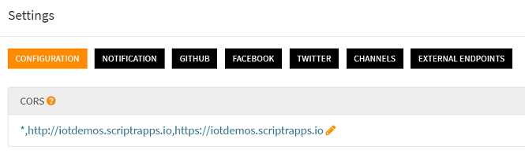

# How to accept requests from other domains (CORS settings)?

CORS (Cross-Origin Resource Sharing) is a mechanism that allows resources on a web page to be requested from another domain
outside the domain from which the resource originated.

By default, scriptr.io only accepts requests stemming from web pages orginated from your own scriptr.io account. 
If you wish to be less restrictive, you can configure the CORS settings from the [workspace](https://www.scriptr.io/workspace)

- Click on your username at the top right corner of the screen then select **Settings**
- Select the **Configuration** tab
- In the CORS section, enter a list of authorized domain names, or * to accept all domains
- Click on Close to validate

