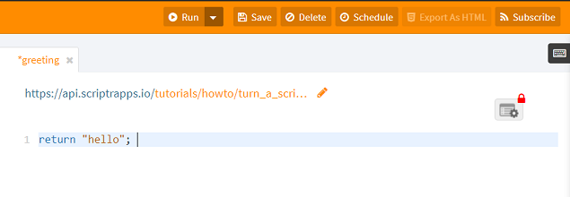
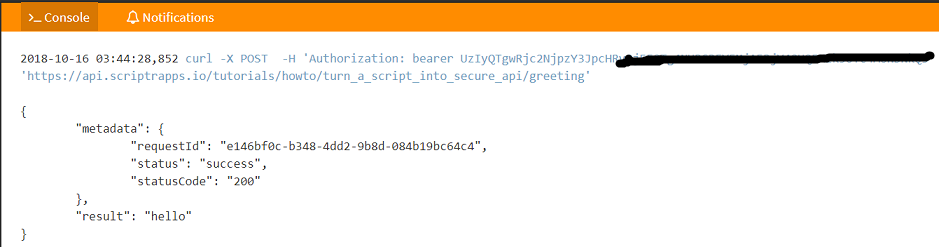
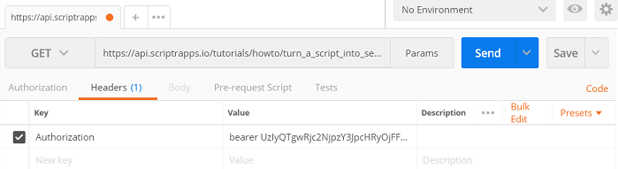

# How to Create a Secure and Scalable API
Scripts are the main components of any scriptr.io application. By default, any script you write is automatically deployed as a secure and scalable API. All scripts are written in standard JavaScript, deployed and ran on the back-end.

## Create a script
- Open your scriptr.io [workspace](https://www.scriptr.io/workspace). In the bottom left corner, click on "New Script". 
- In the editor, simply type the below:
```
return "greetings"
```


*Image 1*

- Give a name to your script then click on "Save" in the toolbar. You script is automatically deployed as a secure API, with it's own endpoint. 
- **You now have a public secure API, accessible via http, websockets, mqtt and ampq!**

**Note**
The endpoint of the script is by default "https://api.scriptrapps.io/path_to_script/script_name", e.g. https://api.scriptrapps.io/tutorials/howto/turn_a_script_into_secure_api/greeting. To create a path, just type it before the script name.

## Try the new API from the workspace
- You can execute a script by clicking on "Run" in the toolbar. The output of the script's execution will be displayed in the console. 
- The output is a JSON object that contains a metadata section and a result section, containing anything returned by the script (in our case "hello")
- Notice that the console displays a cURL instruction to trigger the script from a remote http client



*Image 2*

## How do I know this is a secure API?
- In Image 1, notice the red lock on the top right corner of the script. This indicates that the execution of the script is restricted to authorized entities (by default, authenticated devices and users of your account)
- In Image 2, notice that the cURL instruction passes a bearer token in the Authorization header. Scriptr.io will reject any attempt to invoke a secure script if no valid token is provided. 

## Try the new API from the browser 
- Copy your script's endpoint and paste it into a web browser 
- Pass your auth token as a query parameter using auth_token, e.g. https://api.scriptrapps.io/tutorials/howto/turn_a_script_into_secure_api/greeting?auth_token=UzIyQTgwRjc2NjpzY3JpcHRyOjFFOT###################### 

## Try the new API from [Postman](https://www.getpostman.com/)
- Open Postman
- Select Get as the http method
- Type the script endpoint in the request URL field
- Select the "Headers" tab and create the Authorization header field. Set it's value to "bearer your_scriptr_auth_token"



*Image 3*


