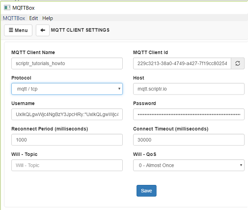
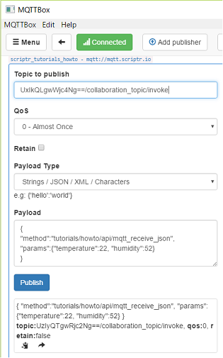

# How to publish the message to a script? ##

- Any script you write in scriptr.io is by default turned into a secure and scalable API that is invokable via http (in addition to webockets, mqtt and amqp).
- The important thing to remember is that any script can retrieve the parameters it receives using the native request object that allows you to retrieve information about the request, including the conveyed parameters.

## What credentials should I use? ##

When publishing mqtt messages to a script, you shoud specify a username and password, as well as a topic. 
Obtaining these is described in [How to obtain credentials to publish mqtt messages to my scriptr.io account?](../mqtt/obtain_credentials.md)

## What is the format of the message to publish?

When you **directly invoke** a script via mqtt, you need to adopt a predefined message structure in JSON:
```
{
"method":"path/to/script",
"params":key/value pairs
}
```
The **method** field contains the path to the script and the **params** field contains a key/value pairs payload (no nested objects allowed). Example:
```
{
"method":"tutorials/howto/api/mqtt_receive_json",
"params":{"temperature":22, "humidity":52}
}
```

## Publish example with mosquitto ##

- Install the [mosquitto client](http://mosquitto.org/download/) if needed
- Replace the values of the -t, -u, -P, and -m with your own respective topic, username, password and message, based on the above explanations

```
mosquitto_pub -t "UxIkQLgwWjc4Ng==/collaboration_topic/invoke" 
-u "UxIkQLgwWjc4NgBzY3JpcHRy:"UxIkQLgwWjc4Ngpub2RlMDAxQHNjcmlwdJK=" 
-P "UxIkQLgwWjc4Ngpub2RlMOPxOjU3QTQ1MTQyM0JGOTAzSXc3RTE4OENENTVzRDAANTcx" 
-h "mqtt.scriptr.io" -p 1883 
-m "{\"method\":\"tutorials/howto/api/mqtt_receive_json\", \"params\":{\"temperature\":22, \"humidity\":52}}"
```

## Publish example with MQTTBox ##

- Install [MQTTBox](http://workswithweb.com/html/mqttbox/downloads.html) if needed
- Replace the values of the field in the below form with your own respective username, password, based on the above explanations



- Replace the values of the field in the below form with your own respective topic and message, based on the above explanations




# More

- [How to read the messages sent to my API through mqtt?](./read_mqtt_messages.md)
- More on [using scriptr.io as an mqtt broker](https://www.scriptr.io/documentation#documentation-communicating-over-mqttScriptr.ioMQTTBroker)


