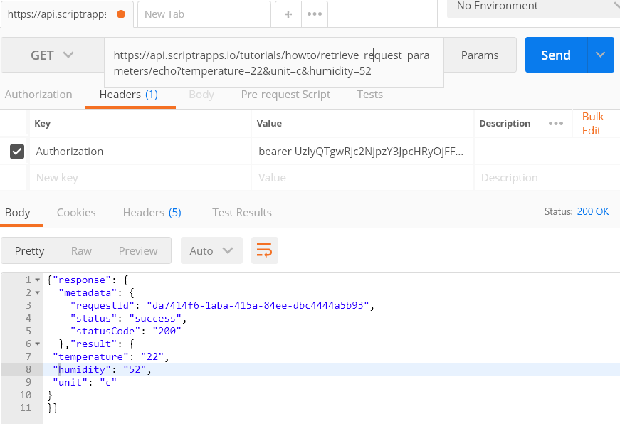
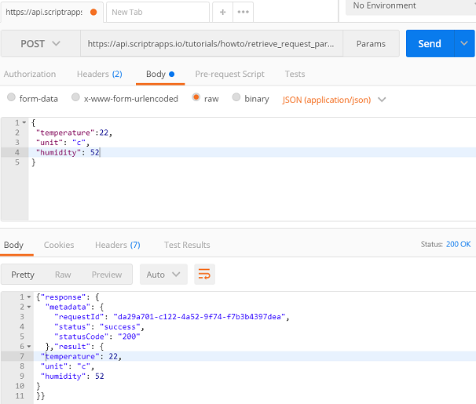

# How to retrieve the parameters sent to my API via http?

- Any script you write in scriptr is by default turned into a secure and scalable API that is invokable via http (in addition to webockets, mqtt and amqp). 
- The important thing to remember is that any script can retrieve the parameters it receives using the native **request** object that allows you to retrieve information about the request, including the conveyed parameters.

## HTTP requests

Http requests can be sent by client applications usign any of GET, POST or PUT with different content-types (for POST and PUT). 

- Before we test all possibilities, go ahead an create a script in your scriptr [workspace](https://www.scriptr.io/workspace).
- For now, we will just type "return true" and save the script

**HTTP GET, HTTP POST/PUT with content-type == "application/x-www-form-urlencoded" or "multipart/form-data"**

- In that case, the parameters of the request are retrieved using **request.parameters**
- Let's update our script to echo back object and save our changes. 

```
return request.parameters;
```

Let's try invoking our script using [Postman](https://www.getpostman.com/) using a GET request, passing our parameters in the query string. 
In this example, we will pass "temperature", "unit" and "humidity" (don't forget to pass a valid auth token in the Authorization header)



*Image 1*

Let's try again invoking our script using [Postman](https://www.getpostman.com/) using a POST request, passing our parameters in the body as "application/x-www-form-urlencoded". 


*Image 2*

**HTTP HTTP POST/PUT with content-type == "application/json"**

- In that case, the JSON object that is sent along with the request is obtained using **request.body**
- Let's update our script to return request.body this time, instead of request.parameters and save our changes

```
return request.body;
```

Once again, let's try invoking our script using [Postman](https://www.getpostman.com/) using a POST request, passing our parameters in the body as a JSON object



*Image 3*

**HTTP HTTP POST/PUT with text based content-type (e.g. text/plain)**

- Use **request.rawBody** to retrieve any textual content
- request.rawBody also contains any body content that could not be parsed by scriptr.io

```
return request.rawBody;
```
