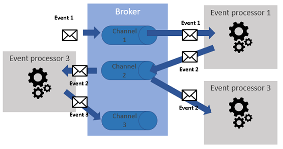
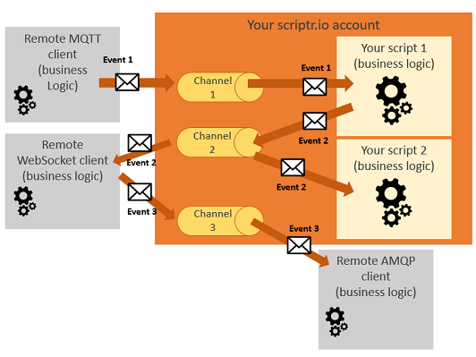
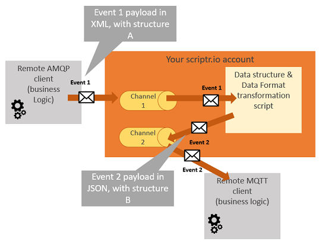
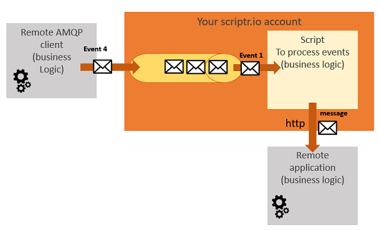

# Broker

The Broker architecture pattern is used in a wide range of applications in different domains, from "traditional" enterprise systems to IoT applications. The purpose of the broker pattern is to enable **asynchronous** collaboration (a.k.a choreography) among different software components, based on the occurrence of events rather than on a well-defined and centralized process. Applications leveraging this pattern fall into the category of **event-driven architectures**. One main advantage of using the Broker pattern is the flexibility it brings into an architecture, by decoupling event producers from event consumers (processors).

Typically, three components are at the core of a Broker-based architecture: (1) the broker, which receives events and dispatches them into (2) event channels, and (3) the event processors that consume the messages from the channels. Event processors can also push new events to the broker. The event channel can adopt two distinct behaviors: (a) it can be a message queue, used as a buffer from which a specific event processor will consume messages, or (b) it can be a topic, used for broadcasting the messages to any event processor that is subscribed to the event channel.



*Figure 9 - Broker Pattern*

# Implement the Broker pattern with scriptr.io
Implementing the Broker pattern with scriptr.io is very straightforward and simple, because all of the corresponding concepts are natively present in the platform.

## Event processors
The beauty of scriptr.io is that any entity, whether it is a script within your scriptr.io application or an external application (including other scriptr.io applications) can be an event processor, i.e. consume events/messages from, or produce events/messages to your channels. You can thus turn your scriptr.io application into a powerful integration middleware.

The below figure illustrates this with an example where a client application sends an event (event 1) to a channel (channel 1) of a scriptr.io application. Event 1 is consumed by one of the scripts hosted by this application (script 1), which executes some business logic. Once done, script 1 emits a new event (event 2) to another channel (channel 2), trigerring the execution of more business logic in the two event processors that consume this event, i.e. script 2 and an external application. The latter issues a third event (event 3) to channel 3, which is consumed by another third party application.



*Figure 10 - Implement business logic via a choreography and integration with 3rd parties*

With a few lines of code, you can turn your scriptr.io application into a powerful integration and interoperability middleware, by creating a first layer of event processors (your scripts) to transform incoming data into a target format (a.k.a "message translation"), then letting those event processors publish the transformed events into other channels to which are subscribed third party event processors.



*Figure 11 - Implement business logic via orchestration and integration with 3rd parties + data transformation*

## Channels
Channels are native constructs in scriptr.io, so creating one is done in a few clicks. Please check this [how-to guide](https://github.com/scriptrdotio/howto/blob/master/publish_subscribe/create_channel.md). It is worth noting that scriptr.io's channel are independant from the protocol used to convey messages (any of http, websockets, amqp, mqtt works). 

### Topic event channels 

Channels behave by default as topics, i.e. they are used to broadcast messages. 

- To subsribe one of the scripts in your scriptr.io application to a channel (turn it into an event processor), you have two options:
  - From the UI of the workspace, open the script, click the Subscribe option in the top-right corner of the code editor, then select the channel you want to subscribe the script to
  - From the code of another script, just write subscribe ```subscribe("<your_channel_name>", "<path_and_script_name>")```
- Subscribing remote clients to your channels or publishing events to remote third parties is respectively a matter of configuration and writing 2 to 3 lines of code. We advise resorting to the [how-to guides](https://github.com/scriptrdotio/howto/blob/master/README.md#how-to), for example:
   - [Subscribe a remote MQTT client to one of your channels](https://github.com/scriptrdotio/howto/blob/master/mqtt/subscribe_mqtt_client.md#how-to-subscribe-a-remote-mqtt-client-to-receive-messages-from-my-scriptr-account) shows how to do this for an MQTT client.

### Queue event channels

You can use channels to create task (job) queues. Queues are notably used to deal with event producers that generate events/tasks at a pace that is higher than what event processors can process, allowing your application to absorbe peeks and remain responsive. Currently, you can only subscribe scripts in your application to your queues, but your scripts can push the data they receive to any remote 3rd party, using any of the supported protocols. For more on queues, please refer to the [how-to guide](https://github.com/scriptrdotio/howto/blob/master/queuing/queue_tasks.md) and the [documentation](https://www.scriptr.io/documentation#documentation-queuemodulequeueModule).



*Figure 12 - Absorb load peaks with queues*

## Other architecture patterns

- [Mediator](./mediator.md)
- [Microservice](./micro_services.md)
- [Layered (monolithic)](./layered.md)

[Back to Solution Architect Booklet ToC](./solution_architect_booklet.md#toc)
