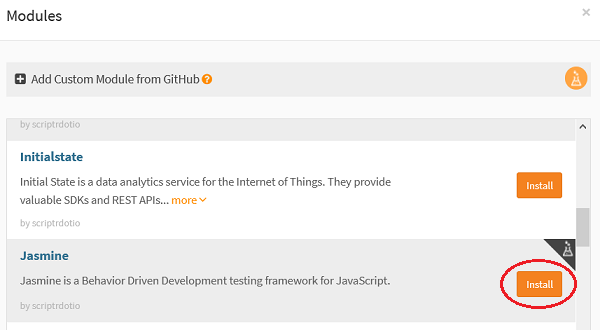
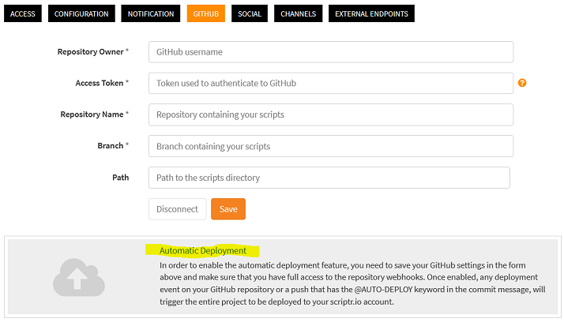
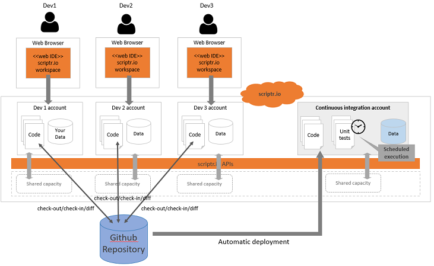

# Development life-cycle

A nice things about scriptr.io is that you do not have to think about how to deploy your code: everything you implement from the scriptr.io workspace is immediately and automatically deployed on the cloud and becomes accessible online - with appropriate security checks, all handled on your behalf. This fosters a fast, incremental and agile development approach, where you can quickly and safely iterate from a prototype to a full-fledged production-ready application. 

Yet, as mentioned in the introductory section, development teams are sometimes puzzled about how they can leverage this flexibility and how to organize themselves: 
- How can they work together on the same project? 
- How can they test their code? 
- How can they create a staging environment?

We will answers those questions in the following sections:

- [Team work](./development_life_cycle.md#team-work)
- [Unit testing](./development_life_cycle.md#unit-testing)
- [Continuous integration testing](./development_life_cycle.md#continuous-integration-testing)
- [Staging](./development_life_cycle.md#staging)

## Team work
Scriptr.io natively integrates with Github. You simply need to link an application in your account to a Github repository by clicking on the gear icon in the workspace, then selecting Github, the providing a Github repository name and token. From the workspace you can issue check-out/pull or push commands and also compare your current version of the code with the one on the repository (for details, please refer to the [corresponding scriptr.io documentation](https://www.scriptr.io/documentation#documentation-githubGitHubIntegration).

When working as a team, this means that each developer owns a scriptr.io account (on any of the aforementioned possible configurations). Therefore, each developer can have it's own copy of the code that is retrieved from Github. This also means that each developer can try his changes in real-time **without interfering with the others** since his code and data are located in his own *silo* (scriptr.io account + associated run-time)!

*Figure 4 - Team work*

## Testing the code

Scriptr.io provides a customization of the [Jasmine](https://jasmine.github.io/) unit testing framework that you can leverage from within your scriptr.io projects.

### Unit testing
To use Jasmine for creating unit tests, all you need to do is to deploy the module into your account, which is very easy to achieve:

- From you workspace, click the small arrow in the bottom left corner of the screen near +New Script then select "Install module"

*Figure 5 - Install a module*

In the modules panel, scroll down to Jasmine press Install. This will automatically install the Jasmine module into the /modules folder of your account.

*Figure 6 - Select Jasmine*

For more on how to create unit tests with Jasmine in scriptr.io, please refer to [our documentation](https://github.com/scriptrdotio/jasmine/blob/master/README.md).

### Continuous Integration testing
In a continuous integration approach, you would like to regularly run all the unit tests (implemented by the different developers) at regular intervals. One good practice for that is to create a specific scriptr.io account that is associated to the Github repository of the application (the one where developers commit their code and unit tests), and to activate the automatic deployment option. As a result, any code commited to the Github repository will automatically be delployed on the Continuous Integration test account.

*Figure 7 - Enable automatic deployment from Github*

You can then schedule the execution of all the unit tests so they are ran automatically. While you can manually schedule the execution of a script (unit tests are scripts) a better approach it to write a small script (scheduled as well) that will list all the unit tests in the current account (the Continuous Integration account), and schedule the execution of any script that has not be already scheduled. For more on scheduling scripts, please refer to the [corresponding how-to](../cron/create_cron_job.md).

*Note: thanks to the flexibility of scriptr.io, there are many ways of automating the execution of the unit tests in the integration test account. For example, you can also create a script that regularly lists all unit tests in the account, then queue a task to execute each test.*

*Figure 8 - Automatic Continuous Integration testing*

## Staging
To create a staging environment, you can simply create a new scriptr.io account (e.g. stagin account) and associate it with the corresponding Github account, and also enabling automatic deploy (same as for continuous integration testing). 

If you also mean to run load tests, then you might want to consider your options:

- If you are on a paid shared environment, you must ask to customize the throtling of the staging account, identically to what you will ask for production. This will of course incur additional charges.
- You can opt for a dedicated environment to host your staging account.

**ToC**
- [Environment configuations](./environment_configurations.md) you can have on scriptr.io
- [Development life-cycle](./development_life_cycle.md)
- [Architecture patterns](./architecture_patterns.md)
- [Scalability](./scalability.md)
