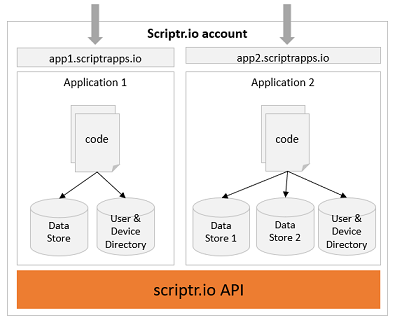

# Environment configurations
There are three possible base configurations:
- [Free shared environment](./environment_configurations.md#free-shared-environment)
- [Paid shared environment](./environment_configurations.md#paid-shared-environment)
- [Dedicated environment](./environment_configurations.md#dedicated-environment)

In any of these, accounts will be created, therefore it is important to also understand the [anatomy of a scriptr.io account](./environment_configurations.md#anatomy-of-a-scriptrio-account).

## Free shared environment
This is an ideal option to become familiar with the power of scriptr.io, at no cost. Although highly reliable, it is not meant for production.

When you first [sign-up to scriptr.io](https://www.scriptr.io/register), you obtain a free acount on a multitenant scriptr.io environment (free shared environment). This account gives you access to the [workspace](https://www.scriptr.io/workspace) (a web IDE) from which you can start using most of scriptr.io's features and services for free, to build your applications. As mentioned, your code is automatically deployed and runs on the cloud (figure 1). 

*Figure 1 - Free shared environment*

Although this is a shared environment, your have your owmn isolated "silo", which means none of your data and your code are shared with other account owners, nor accessible to them in any way. There is not limitations in the number of accounts you can create on this environment, but (1) **the capacity is throttled** and (2) **some of the features are only accessible for a trial period and a few are not available**.

## Paid shared environment
This is a good option for small to medium applications or when you are starting and need to progressively increase your capacity.

Once you feel more comfortable and you are ready to move to production, you can ask for one or more accounts on the paid shared environment. As in the free tier, you will share capacity with other account owners, however, you can ask for customized throttling (max number of requests per second, max number of documents, etc.) depending on your requirements. You can also purchase paid features, such as messaging or adding different data store types to your account. Note that since this is a shared environment, there is a limit to how much your application can scale. Another different with the free tier is the SLA (Service Level Agreement) and corresponding QoS (Quality of Service) you will get.

*Figure 2 - Paid shared environment*

## Dedicated environment
This is the most flexible option for medium to large and very large applications, when you have high performance and scalability requirements.

When your application reaches cruising speed or if you need high performance and scalability, you can ask for a dedicated scriptr.io environment. As its name imply, this environment will be dedicated to your application so it will not share any capacity with others. Optionnally, you can ask to enable multi-tenancy on your environment so you get the ability to create multiple accounts in it. This might make sense depending on your business requirements and/or your architecture, as it is discussed in the corresponding section. In this configuration as well, you can purchase additional features from the set of paid features provided by scriptr.io. Of course, this is a scriptr.io managed environment, you do not need to worry about a thing. 

In a dedicated environment, you can also expect to select between multiple different SLA and QoS. It is also worth mentioning that dedicated environments will be sized according to your needs and they can be resized accordingly.

*Figure 3 - Dedicated environment*

## Anatomy of a scriptr.io account
Regardless of the scriptr.io environment you select, you will always create one or many accounts to implement your applications/solutions. In an account, you can create **applications**. For each application you can create:
- Backend scripts (run on the cloud) that implement the business logic and the API of the application 
- UI scripts, such as dashboards (run in the browser), if you need a front-end to visualize data and/or allow users to interact with your application
- One or multiple data stores (a default data store is automatically created), 
- Users, devices and groups of your applications that you create in the directory of the application. 

Applications can leverage all the scriptr.io APIs and components and they are isolated from each others, which means that they do not share their data, nor their users and devices.
Interesting to note, you can create a globally unique sub-domain name for your application directly from your workspace (additionally, you can ask the scriptr.io team to associate your applications to your own domain names).

*Figure 4 - Anatomy of a scriptr.io account*

# Solution Architecture Booklet ToC

- [Environment configuations](./environment_configurations.md) 
- [Development life-cycle](./development_life_cycle.md)
- [Architecture patterns](./architecture_patterns.md)
- [Scalability](./scalability.md)
- [Security](./security)
