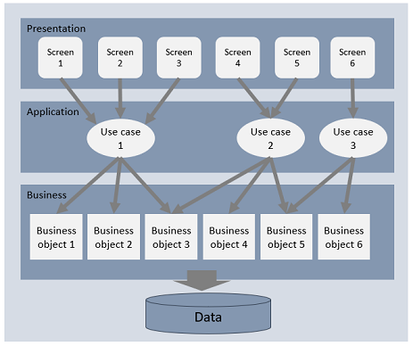

# Layered architecture

The layered architecture is the most common of the architecture patterns that are discussed in this document. 
Well-designed applications will usually be composed of logical horizontal layers, each dedicated to fulfilling a given role. The main layers are usually: 
- The presentation layer, responsible for the UI and user workflow (navigation among the UI screens)
- The application layer, that implements the processes (steps) of the application, through the manipulation of the features that are offered by the components of the business layer.
The logic implemented in the application layer is specific to that application's use cases. In the case of web/mobile applications, this layer also can expose an API or front controllers that are remotely accessible from the UI, via http or websockets
- The business layer, which implements the business logic and business objets. They reflect the main concepts of the business domain that is covered by the application and they are usually persistent, i.e. their state will be saved into a durable data store. 
- The data layer is where business data is persisted. It is typically a database, relational or not.

*Figure 1 - Layered Architecture*

Layered architecture are usually monolithic, i.e. they are bundled and deployed as a single component into some hosting environment, such as an application server for example. A Java Web application for instance would be packaged as a WAR file and deployed into a JEE application server or servlet container. Monolithic applications only allow for reusing business objects as code (libraries or frameworks), and not share them among multiple distributed applications, such as in the case of [Microservices](./micro_services.md).

## Implementing the layered architecture with scriptr.io

That's very easy. Within a scriptr.io application, you can create one logical folder for each layer of the applications (you can then create additional logical sub-folders to organize a layer). We mention "logical folders" as there are no folders in scriptr.io, rather you can logically create a distribution of your scripts using path separators. For example, /presentation/signup/sign-up.html creates the sign-up.html script into the logical "signup" folder within the "presentation" folder. Hence a typical layered scriptr.io application would typically have three main folders, "presentation", "application", "business" (you can name them as you want to). The data store of the scriptr.io application is the data layer, directly accessible from any script via the "document" module.

Note that so far, you can only create HTML/CSS and JavaScript pages for the presentation layer. You can also leverage scriptr.io's [UI components library](https://github.com/scriptrdotio/UIComponents) and dashboard builder. The UI is served by scriptr.io but executes in web browsers.

## Other architecture patterns
- [Broker](./broker.md)
- [Mediator](./mediator.md)
- [Microservice](./micro_service.md)

[Back to Solution Architect Booklet ToC](./solution_architect_booklet.md#toc)
