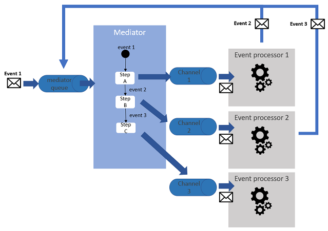
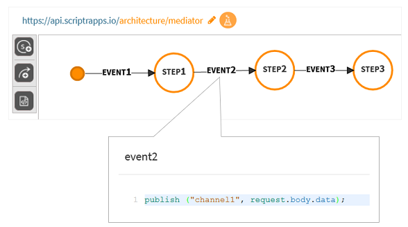

# Mediator

Along with the Broker, the Mediator allows for the implementation of an event driven architecture. As opposed to the Broker that favors choreography, i.e. collaboration among software components, the Mediator relies on orchestration, ranging from the centralization of a few event/message routing rules to the full definition of a business process. The steps of the process are usually implemented by different software components that consume events sent by the mediator and optionally generate events in response. Events are used by the mediator to move forward in the process. The Mediator pattern is mainly used in SOA architectures, and commonly implemented as an Enterprise Service Bus (ESB).

The main constituants of the Mediator patterns are : (1) the event queue, which buffers incoming events that trigger orchestrations, (2) the mediator, in charge of orchestrating the execution by either forwarding the events to channels or generating new events, (3) the event channels and (4) the event processors that asynchronously process the events and optionally generate other events into the mediator's queue (note that it is also possible to send a synchronous event to an event processor from the Mediator). 



*Figure 1 - The Mediator Pattern*

# Implement the Mediator pattern with scriptr.io

This is easy to do because the required constituants are natively available in scriptr.io. You can thus turn your scriptr.io account into a **lightweight service bus** on top of your SOA.

## Event queue
Queue are natively supported in scriptr.io, they are actually a specific way of using channels, therefore, to create an event queue that will feed your mediator, you must create a channel (see below). In addition, if you expect to receive events from external entites (remote applications or other scriptr.io applications), you must also create a script that will receive those events then push them into the queue (see examble below). 

```
// this script exposes the event queue to external applications
var queue = require("queue");
var queueClient = queue.getInstance("event_queue"); // we have created a channel called event_queue 
queueClient.queue("architecture/mediator", {"event": request.parameters.event}); // push the received event to the queue
``` 
## Mediator
There are multiple ways of implementing a mediator in scriptr.io. The simplest way would be to create a [state-machine](https://blog.scriptr.io/using-finite-state-machines-to-build-iot-applications/), since state/transition diagrams are well suited to represent event-driven business processes. Transition can be customized to include some basic processing (e.g. message translation) and mainly to publish events to other channels, that will trigger the execution of the event processors.



*Figure 2 - Implement a mediator with a state-machine.*

## Event processor
As also mentioned in the [Broker Pattern section](./broker.md#event-processors), any entity, whether it is a script within your scriptr.io application or an external application (including other scriptr.io applications) can be an event processor. 
## Channels
Channels are very simple to create in scriptr.io. Please refer to this section (./broker.md#channels) to see how to create channels and queues in scriptr.io.


