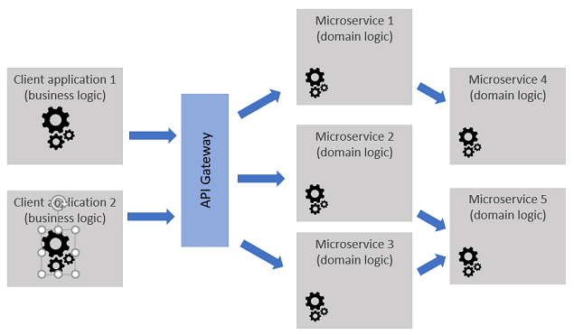
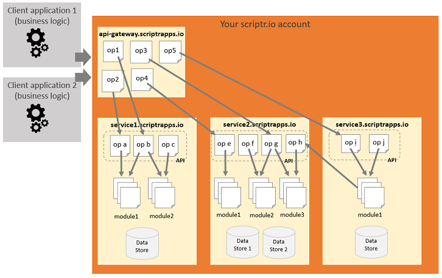

# Microservices

Microservice architectures are an evolution of SOA. Microservice are software components that implement the logic of a specific domain (e.g. order management, maintenance operation scheduling, etc.). They are deployed as separate and decoupled units, exposing operations through remotely accessible interfaces and communicating with each other through remote communication protocols (http, mqtt, etc.). As a consequence, Microservice architectures fall into the category of distributed software architectures. Because Microservices foster decoupling, they will usually store and manage their own data and relie as little as possible on the operations of other Microservices. 

The operations of the Microservices composing an information system can be exposed to the outside world through an API gateway, which provides additional security and control (e.g. throttling) over how the services can be used. Applications built using Microservices will usually implement specific business logic by legeraging the operations that are provided by the different services, via the API gateway or by directly accessing the services.

*Figure 1 - Microservice architecture*

# Implementing Microservices with scriptr.io

It is very easy to implement Microservices with scriptr.io. As mentioned in the [anatomy of a scriptr.io account](./environment_configurations.md#anatomy-of-a-scriptrio-account), an account allows you to create one or multiple applications, each having its own sub-domain name, data store(s) and user/device directory. Moreover, each application can access all of scriptr.io's features and APIs, notably those allowing it to communicate with other remote entities.

The best way to implement a Microservices is thus by implementing a scriptr.io application. The operations of the Microservice will be exposed through an API composed of scripts, which will convey the received requests and messages to the internal modules (other scripts) that implement the domain logic. One of the nice things about using scriptr.io is that your API scripts will be remotely accessible using any of the communication protocols that are supported by scriptr.io (http, mqtt, amqp, websocket) **without any change**.

If you need to hide Microservices behin an API gateway, a simple way of doing that is by creating another application that would be the entry point of your architecture. Note though that the other applications (the Microservices) would remain publicly accessible by default (you must contact the scriptr.io team to change that).

*Figure 2 - Implement Microservices via scriptr.io applications*

**Notes**:
- You do not have to package and deploy your Microservices yourself since, as already discussed, scriptr.io is a [managed servless environment](./scriptr_solution_architect_document.md#scriptrio-solution-architect-booklet) and all your scripts are [automatically deployed](./development_life_cycle.md#development-life-cycle) on the cloud. 
- Since each application has its own user/device directory, there is no unique identity management service your Microservices can refer to. You could implement one but you would loose the automatic authentication and authorization checks that are provided by scriptr.io for each application.

**Other architecture patterns**
- [Broker](./broker.md)
- [Mediator](./mediator.md)
- [Layered (monolithic)](./layered.md)

# Solution Architecture Booklet ToC
- [Environment configuations](./environment_configurations.md) you can have on scriptr.io
- [Development life-cycle](./development_life_cycle.md)
- [Architecture patterns](./architecture_patterns.md)
- [Scalability](./scalability.md)
- [Security](./security)
