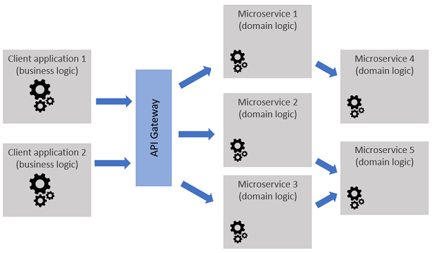

# Microservices

Microservice architectures are an evolution of SOA. Microservice are software components that implement the logic of a specific domain (e.g. order management, maintenance operation scheduling, etc.). They are deployed as separate and decoupled units, exposing operations through remotely accessible interfaces and communicating with each other through remote communication protocols (http, mqtt, etc.). As a consequence, Microservice architectures fall into the category of distributed software architectures. Because Microservices foster decoupling, they will usually store and manage their own data and relie as little as possible on the operations of other Microservices. 

The operations of the Microservices composing an information system can be exposed to the outside world through an API gateway, which provides additional security and control (e.g. throttling) over how the services can be used. Applications built using Microservices will usually implement specific business logic by legeraging the operations that are provided by the different services, via the API gateway or by directly accessing the services.

*Figure 1 - Microservice architecture*

