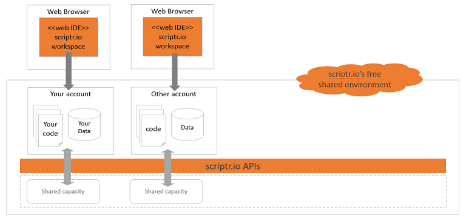
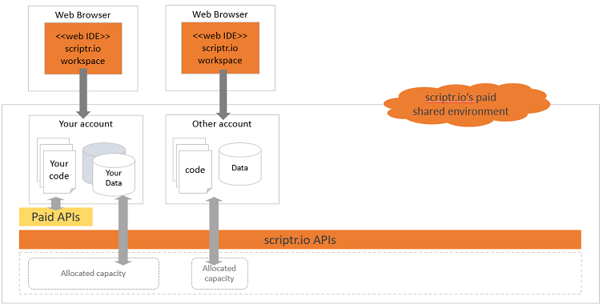
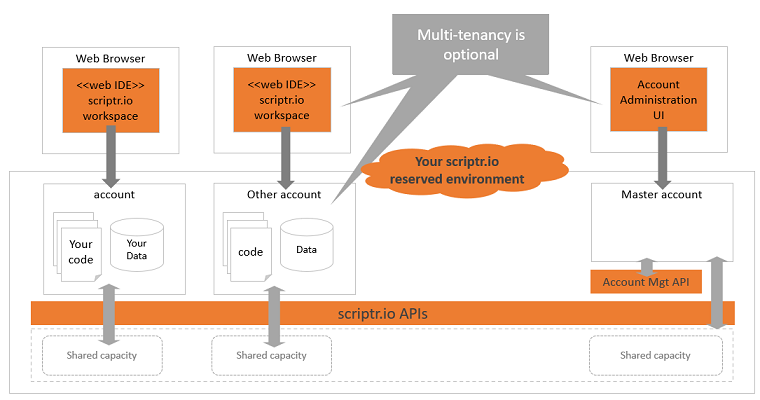
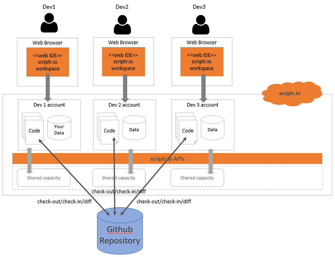

# Scriptr.io solution architect booklet

As you may already know, scriptr.io is a [managed serveless environment](../whatis/whatis_scriptr.md) that provides many services and components that you can leverage from within your code. This mainly means that it will make your life much easier when developping your applications, whether these are simple IoT applications ingesting and displaying device data, or large enterprise-grade solutions, integrating with multiple third parties and legacy systems.

Software architects and developers that are new to scriptr.io, and less familiar with serveless environments, might sometimes be disoriented at first as how to start. They often have some - legitimate - questions, some related to the development life-cycle and some others to the possible architectures of the solutions they can build with scriptr.io: how to work as a team? Are there development and staging environments? How to test the code? What type of software architectures can be implemented? How to scale, etc.?

This document is thus aimed at providing answers to the most common questions we have received and is structured as follows: 

- First section is a short discussion on the different [configuations](./scriptr_solution_architect_document.md#environment-configurations) you can have on scriptr.io
- Second section will tackle questions around the [development life-cycle](./scriptr_solution_architect_document.md#development-life-cycle)
- Third section will describe how to implement some of the most [common architecture patterns](./scriptr_solution_architect_document.md#architecture-patterns) with scriptr.io
- Fourth section will discuss [scalability](./scriptr_solution_architect_document.md#scalability).

Of course, you can always [contact us](mailto:support@scriptr.io) for any question. We also recommend checking the [how-to guides](https://github.com/scriptrdotio/howto/blob/master/README.md#how-to) and scriptr.io's [official documentation](https://www.scriptr.io/documentation).

# Environment configurations
There are three possible base configurations:
- [Free shared environment](./scriptr_solution_architect_document.md#free-shared-environment)
- [Paid shared environment](./scriptr_solution_architect_document.md#paid-shared-environment)
- [Dedicated environment](./scriptr_solution_architect_document.md#dedicated-environment)

## Free shared environment
This is an ideal option to become familiar with the power of scriptr.io, at no cost.

When you first [sign-up to scriptr.io](https://www.scriptr.io/register), you obtain a free acount on a multitenant scriptr.io environment (free shared environment). This account gives you access to the [workspace](https://www.scriptr.io/workspace) (a web IDE) from which you can start using most of scriptr.io's features and services for free, to build your applications. As mentioned, your code is automatically deployed and runs on the cloud (figure 1). 

*Figure 1 - Free shared environment*

Although this is a shared environment, your have your owmn isolated "silo", which means none of your data and your code are shared with other account owners, nor accessible to them in any way. There is not limitations in the number of accounts you can create on this environment, but (1) **the capacity is throttled** and (2) **some of the features are only accessible for a trial period and a few are not available**.

## Paid shared environment
This is a good option for small to medium applications or when you are starting a need to progressively increase your capacity.

Once you feel more comfortable and you are ready to move to production, you can ask for one or more accounts on the shared production environment. As in the free tier, you will share capacity with other account owners, however, you can ask for customized throttling (max number of requests per second, max number of documents, etc.) depending on your requirements. You can also purchase paid features, such as messaging or adding different data store types to your account. Note that since this is a shared environment, there is a limit to how much your application can scale. 

*Figure 2 - Paid shared environment*

## Dedicated environment
This is the most flexible option for medium to large and very large applications, when you have high scalability requirements.

When your application reaches cruising speed or if you need high performance and scalability, you can ask for a dedicated scriptr.io environment. As its name imply, this environment will be dedicated to your application so it will not share any capacity with others. Optionnally, you can ask to enable multi-tenancy on your environment so you get the ability to create multiple accounts in it. This might make sense depending on your business requirements and/or your architecture, as it is discussed in the corresponding section. In this configuration as well, you can purchase additional features from the set of paid features provided by scriptr.io. Of course, this is a scriptr.io managed environment, you do not need to worry about a thing.

*Figure 3 - Dedicated environment*

**ToC**
- [Environment configuations](./scriptr_solution_architect_document.md#environment-configurations) you can have on scriptr.io
- [Development life-cycle](./scriptr_solution_architect_document.md#development-life-cycle)
- [Architecture patterns](./scriptr_solution_architect_document.md#architecture-patterns) with scriptr.io
- [Scalability](./scriptr_solution_architect_document.md#scalability)

# Development life-cycle

A nice things about scriptr.io is that you do not have to think about how to deploy your code: everything you implement from the scriptr.io workspace is immediately and automatically deployed on the cloud and becomes accessible online - with appropriate security checks, all handled on your behalf. This fosters a fast, incremental and agile development approach, where you can quickly and safely iterate from a prototype to a full-fledged production-ready application. 

Yet, as mentioned in the introductory section, development teams are sometimes puzzled about how they can leverage this flexibility and how to organize themselves: 
- How can they work together on the same project? 
- How can they test their code? 
- How can they create a staging environment?

## Team work
Scriptr.io natively integrates with Github. You simply need to link you link an application in your account to a Github repository by clicking on the gear icon in the workspace the selecting Github, the providing a Github repository name and token. From the workspace you can issue check-out/pull or push commands and also compare your current version of the code with the one on the repository (for details, please refer to the [corresponding scriptr.io documentation](https://www.scriptr.io/documentation#documentation-githubGitHubIntegration).

When working as a team, this means that each developer owns a scriptr.io account (on any of the aforementioned possible configurations). Therefore, each developer can have it's own copy of the code that is retrieved from Github. This also means that each developer can try his changes in real-time **without interfering with the others** since his code and data are located in his own *silo* (scriptr.io account + associated run-time)!

*Figure 4 - Team work*

## Testing the code
Scriptr.io provides a customization of the [Jasmine](https://jasmine.github.io/) unit testing framework that you can leverage from within your scriptr.io projects. All you need to do is to deploy the module into your account, which is very easy to achieve:

- From you workspace, click the small arrow in the bottom left corner of the screen near +New Script then select "Install module"

*Figure 5 - Install a module*

In the modules panel, scroll down to Jasmine select press Install. This will automatically install the Jasmine module into the /modules folder of your account.

.

**ToC**
- [Environment configuations](./scriptr_solution_architect_document.md#environment-configurations) you can have on scriptr.io
- [Development life-cycle](./scriptr_solution_architect_document.md#development-life-cycle)
- [Architecture patterns](./scriptr_solution_architect_document.md#architecture-patterns) with scriptr.io
- [Scalability](./scriptr_solution_architect_document.md#scalability).

# Architecture patterns

**ToC**
- [Environment configuations](./scriptr_solution_architect_document.md#environment-configurations) you can have on scriptr.io
- [Development life-cycle](./scriptr_solution_architect_document.md#development-life-cycle)
- [Architecture patterns](./scriptr_solution_architect_document.md#architecture-patterns) with scriptr.io
- [Scalability](./scriptr_solution_architect_document.md#scalability).

# Scalability

**ToC**
- [Environment configuations](./scriptr_solution_architect_document.md#environment-configurations) you can have on scriptr.io
- [Development life-cycle](./scriptr_solution_architect_document.md#development-life-cycle)
- [Architecture patterns](./scriptr_solution_architect_document.md#architecture-patterns) with scriptr.io
- [Scalability](./scriptr_solution_architect_document.md#scalability).
