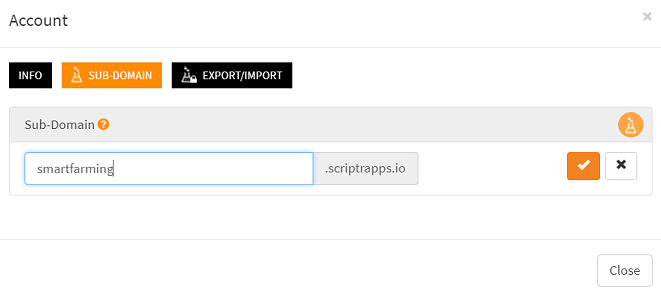

# How to customize the URL of my API (create a sub-domain)?

Scriptr.io allows you to create a **sub-domain** for your account to customize the generic URL prefix used to invoke your APIs (api.scriptrapps.io). 
Hence, if you are building a smart farming application for example, then you might like your URL to be smartfarming.scriptrapps.io. 

- Open your [workspace](https://www.scriptr.io/workspace) the click on your username in the top right corner of the screen
- Click on **Account** then select the **Subdomain tab** in the Account dialog
- Enter a subdomain of your choice then click on the check sign. Scriptr.io will check the unicity of the name and ask you to make another choice if this name is already in use)

*Image 1*

That's it! You can now invoke your API operation using your subdomain (e.g. https://smartfarming.scriptrapps.io/myAPI)
