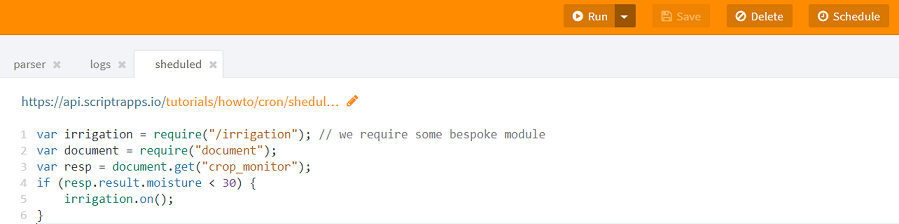

# How to schedule the automatic execution of a script (cron job)?

Scriptr.io allows you to automatically execute your scripts are regular intervals. 
There are two ways to do this: 
- From the [workspace](https://www.scriptr.io/workspace]
- From the code of a script

** Note** scheduled scripts should have a return instruction (you cannot schedule the execution of modules)

## Schedule the automatic execution of a script from the workspace

From the [workspace](https://www.scriptr.io/workspace], select an existing script from the tree view on left-side, 
or create a new script (click on New Script) and type some instructions.

