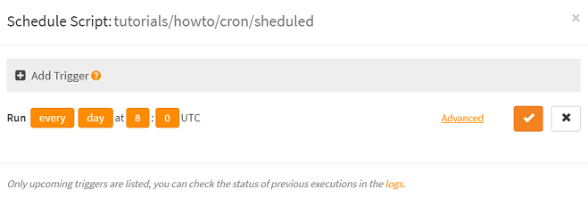
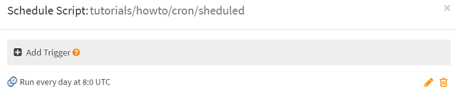
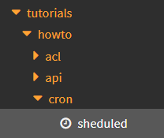

# How to schedule the automatic execution of a script (cron job)?

Scriptr.io allows you to automatically execute your scripts are regular intervals. 
There are two ways to do this: 
- From the [workspace](https://www.scriptr.io/workspace]
- From the code of a script

**Note** scheduled scripts should have a return instruction (you cannot schedule the execution of modules)

## Schedule the automatic execution of a script from the workspace

From the [workspace](https://www.scriptr.io/workspace], select an existing script from the tree view on left-side, 
or create a new script (click on New Script) and type some instructions. Once you script is ready, click on the **⌚chedule** button in the script editor toolbar.


From the "Schedule script" dialog, define your scheduling rule:

- Specify if the script should execture regularly (**every**) or at at specified date/time (**on**)
- Specify the time range (hour, day, week, month or year)
- Specify the hour of execution
- Specify the minute of execution

In the below example, we schedule the script to run every data at 08:00 AM.



*Image 1*

**Note** if you are familiar with [cron expressions](https://www.freeformatter.com/cron-expression-generator-quartz.html), you can directly write an expression by clicking on the Advanced link.

Click on the check sign to save your trigger. It is added to the list of triggers of the script (you can define many triggers for the same script)



*Image 2*

Also notice that a small clock icon is now set next to the script name in the tree view on the left



*Image 3*

## Schedule the automatic execution of a script from the code

From the [workspace](https://www.scriptr.io/workspace] click on "New Script" to create the scheduler script (will contain the code to schedule the execution of another script)

To schedule a script from the code, you just need to invoke the **schedule()** native function, passing the path+name of the script to schedule.

**ATTENTION**
- Always use the absolute path to the script and do not start with "/")
- A script should never schedule itself

```
var document = require("document");
var resp = schedule("tutorials/howto/cron/sheduled", "0 8 * * ?");
if (resp.metadata.status == "success") {
    document.save({"key": "scheduled_script_handle", "handle": resp.result.handle});
}

return resp;
```
The executionof **schedule()** function returns a metadata section and a result section (that latter only if successful)
- metadata.status is set to "success" or "failure"
- If the invocation is successful, **result.handle** contains a schedule handle

**IMPORTANT** as shown in the above example, you should always persist the handle in some document if you need to unschedule your script.

```
// successful execution of schedule() - example
{
  "metadata": {
    "status": "success"
  },
  "result": {
    "handle": "84383B09C51583A68FE0F8FABC9DACC5"
  }
}

// unsuccessful execution of schedule() - example

{
  "metadata": {
    "status": "failure",
    "statusCode": 400,
    "errorCode": "INVALID_SCRIPT_NAME",
    "errorDetail": "Invalid script name [/tutorials/howto/cron/sheduled]."
  }
}
```


