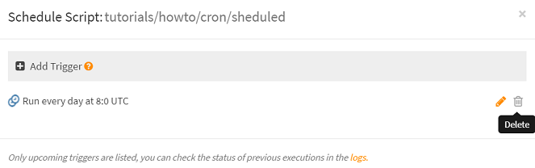

# How to unschedule the automatic execution of a script (cron job)?

There are two ways to do this:

- From the [workspace](https://www.scriptr.io/workspace)
- From the code of a script

## Unschedule a script from the workspace

- Open the [workspace](https://www.scriptr.io/workspace) and browser the tree view on the left to find the scheduled script. 
- Open the script in the editor
- Click on on the ⌚Schedule button in the script editor toolbar
- In the "Schedule Script" dialog, click on the trash can icon near the trigger you wish to remove



## Unschedule a script from the code

Scripts can be unscheduled using the native **unschedule()** function. All you need is pass it the handle obtained when scheduling the script (read more on [how to schedule the automatic the execution of a script](./create_cron_job.md). 

In the example below, we assume that we previously persisted the handle (returned by the **schedule()** function) in a document whose key we set to "scheduled_script_handle". We stored the handle into a field of the document (we name this field "handle").

```
var document = require("document");
var resp = document.get("scheduled_script_handle");
if (resp.metadata.status == "success") {  // if document is found
    
    var handle = resp.result.handle;
    return unschedule(handle); 
}

return null;
```
# More
Read [how to schedule a script](./create_cron_job.md)

For more on how to save/query data into/from documents:
- Read how to [persist data](https://github.com/scriptrdotio/howto/blob/master/data/persist_data.md)
- Read how to [retrieve persisted data](https://github.com/scriptrdotio/howto/blob/master/data/query_data.md)
