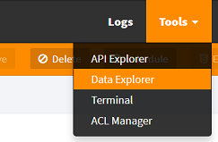
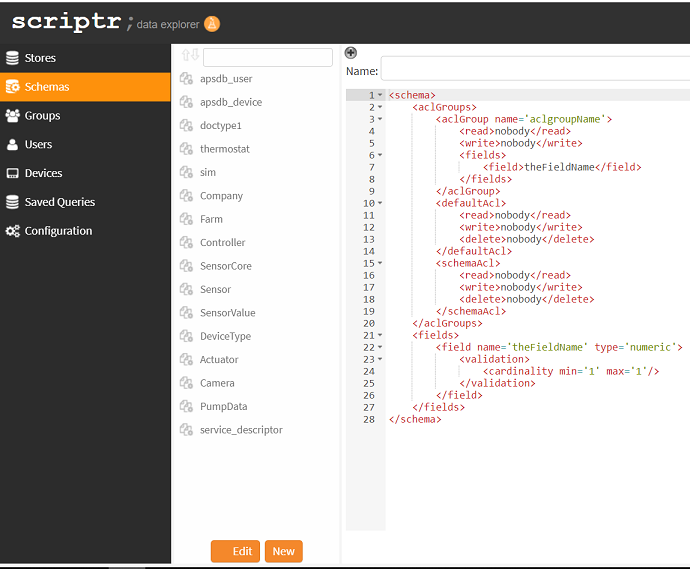

# How to express constraints on my data (schemas)?

- Scriptr.io provides you with a NoSQL database that allows you to save data into key/value structures called "documents"
- You can create (XML) schemas to define constraints on the data (mandatory fields, multiplicity, data types, etc.)

## Create a schema using the visual environment

From the scriptr.io [workspace](https://www.scriptr.io/workspace) click on **Tools** in the toolbar then select **Data Explorer**



*Image 1*

Click on Schema then New to open the schema editor.



A schema has two main sections: aclGroups and fields.

### aclGroups 

ACL groups allow you to define read/write permissions on the fields of your document. You should define at least one ACL group. 
Scriptr.io creates three ACL groups by defaults: 
- &lt;aclGroup name='aclgroupName'&gt; (the name is just a dummy value, you should replace it with somethings meaningful), 
- &lt;defaultAcl&gt; is the default ACL. You can remove this element if you wish
- &lt;schemaAcl&gt; defines permissions on the schema itself. **You usually won't modify it**

An ACL group specifies read/write permissions on the document fields it contains (&lt;fields&gt;)
Permissions are specified via the **&lt;read&gt;** and **&lt;write&gt;** elements, which respectively define who has read and/or write permissions on the fields.

In the below example we created an ACL group called "smart_building_can_write" within which you specify that members of the "smart_building" group and the "building_admin" user have write privilege on the "temperature" and "humidity" fields of documents 
to which this schema is applied. Read permissions are granted to the "authenticated" predefined role, which includes any authenticated
entity in the current scriptr.io account. Owners of the write privilege also have the permission to read.

```
<schema>
	<aclGroups>
		<aclGroup name='smart_building_can_write'>
			<read>authenticated</read>
			<write>group:smart_building,building_admin</write>
			<fields>
				<field>temperature</field>
				<field>humidity</field>
			</fields>
		</aclGroup>
		<schemaAcl>
			<read>nobody</read>
			<write>nobody</write>
			<delete>nobody</delete>
		</schemaAcl>
	</aclGroups>
	<fields>
		<field name='temperature' type='numeric'/>
		<field name='humidity' type='numeric'/>
	</fields>
</schema>
```


