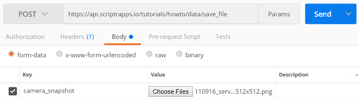
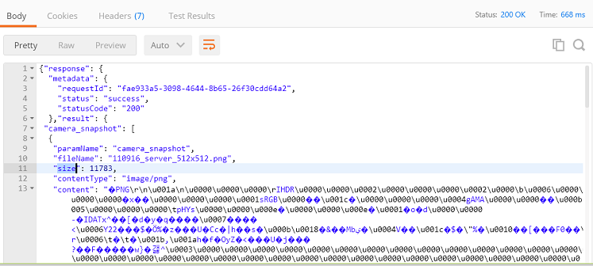

# How to persist files sent to my API via http?

- Any script can retrieve the parameters it receives using the native **request** object that allows you to retrieve information about the request, including the conveyed parameters
- Upload files can be retrieved using the **files** property of the **request** object
- To persist data into document from within a script, you need to require the native **document** module

## Getting the uploaded files

**request.files** is an map of key/values where each key is the name of the parameter used to upload files and the value is an array of File objects

Open your [workspace](https://www.scriptr.io/workspace) and create a new script with the below content
```
var files = request.files;
if (request.files.camera_snapshot && request.files.camera_snapshot.length > 0) {
    var snapshotFile = request.files.camera_snapshot[0];
    return snapshotFile;
};

return null;
```
 
Let's upload a file to the above API using [Postman](https://www.getpostman.com/)



Issuing this request results in the below. As you can see, our API returned an array of File objects containing one element, as expected.



## Saving the file into a document

- Scriptr.io provides you with a NoSQL database that allows you to save data into key/value structures called "documents"
- To manipulate documents, you need to require the **document** module ([read more about creating documents](./persist_data.md))
- To create a document, you need to invoke the **document.create()**, passing the data to persist and any required descriptive metadata

Let's update the above code example, to save the file into a document

```
var document = require("document");
var files = request.files;
if (request.files.camera_snapshot && request.files.camera_snapshot.length > 0) {
    
    var snapshotFile = request.files.camera_snapshot[0];
    var data = {
    	"attachments": snapshotFile, 
        "meta.types": {
            "attachments": "file"
        }
    };
    
	var resp = document.create(data);
    return resp;
};

return null;
```
To create the document, we need to following:
- Create a data structure with at least two properties: "attachments" and "meta.types"
- Link the  uploaded file to "attachements" 
- Informing script.io that this field is of type "file" using the "meta.types" property
- Invoke document.create() passing the whole data structure

**ATTENTION**: **attachments** is a reserved keyword in scriptr.io. It is mandatory to use it to name a document field that contains a file, when the document is not bound to a **schema** (as in our example). In that latter case, you cannot use any field name but only **attachments**. 

(Learn more about [schemas](./create_schema.md))

