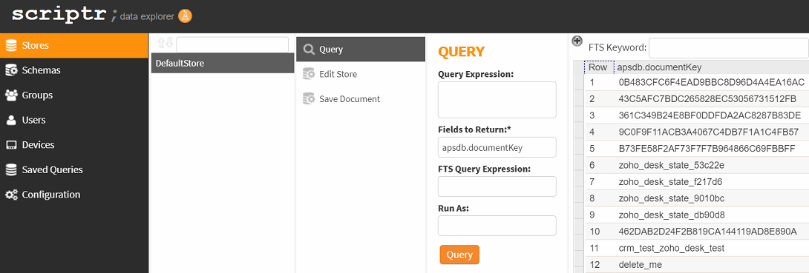
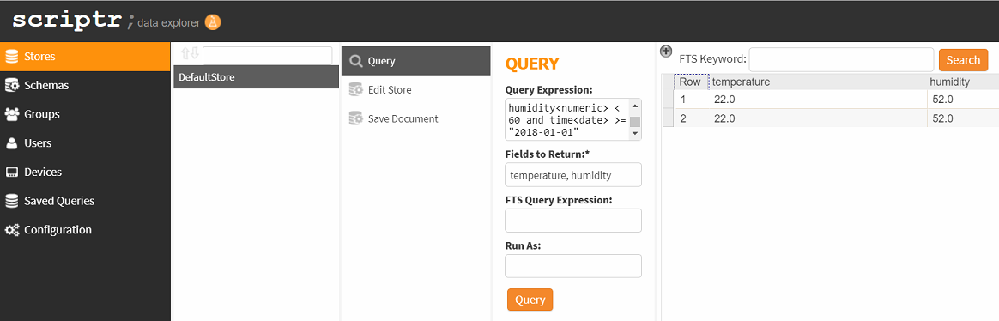

# How to browse through the data that I have persisted?

- From the scriptr [workspace](https://www.scriptr.io/workspace), click on **Tools** in the toolbar then select **Data Explorer**


*Image 1*

- In the Data Explorer, click on **Stores** > **Default Store** > **Query** (if you have many store, select one of them)
- In the Query panel, just press **Query** to query for all documents
- Browse through the resulting documents list and click on any row to see the document's details



*Image 2*

## Can I configure the query?

Sure,

- In the **Query Expression** field, type in some query such as:
```
temperature<numeric> > 20 and humidity<numeric> < 60 and time<date> >= "2018-01-01" 
```
- You can also specify the fields you need to appear in the resulting grid, by typing their names separated by commas in the **Fields to Return** field



*Image 3*

# More
More on [query expressions](./query_data.md)
