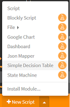
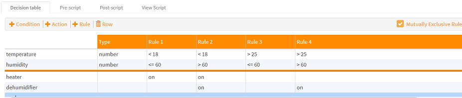
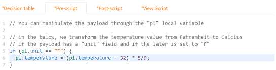
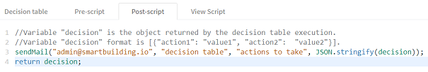

# How to use decision tables?

Scriptr allows you to create advanced condition/action evaluation logic without coding, through [decision tables](https://en.wikipedia.org/wiki/Decision_table).

## Create a decision table

To create a decision table, click on the arrow near +New Script on the bottom left corner of the script, then select **Decision Tables**. Decision table are automatically turned into an API as any other script and thus, they can be invoked by remote clients using any of the protocols that are supported by scriptr.



*Image 1*

## Define rules and actions

- The upper-left part of the decision table is where you set the criteria that you need to evaluate, and the columns specify the conditions you want to associate to these criteria. A rule is a combination of multiple conditions within a same conlumn
- The lower-left part of the decision table is where you specify the actions to execute whenever a rule is verified
- Each column of the decision table can hold a pair of rules/corresponding actions.

For example, assume you need to control the ambiant climate based on temperature and humidity values. You could define the following rules:

- If temperature < 18 and humidity < 60%  turn heater on
- If temperature < 18 and humidity >= 60% turn heater and dehumidifier on 
- If temperature > 25 and humidity < 60%  turn cooler on
- If temperature > 25 and humidity >= 60% turn heater and dehumidifier on 



*Image 2*

**Note** rules are usually mutually exclusive, therefore, once a rule is verified, script stops evaluating the other rules. However, there are cases where multiple rules can be verified simulatenously. If you want scriptr to evaluate all the rules, uncheck the "mutually exclusive rules" checkbox on the top right corner of the decision table.

## Where do criteria come from?

Criteria you use when defining conditions are fields of the request payload that triggers the execution of the decision table. This payload is a JSON object that contains the mandatory "payload" field, which is a map of key/value pairs.

Example of the payload to send for the ambiant climate control example:
```
{
  "payload": {
    "temperature":26,
    "humidity": 40
  }
}
```

## What are actions?

Actions do not automatically translate to anything specific by default. The decision table returns all the actions of the rules that are verified further to receiving the payload. It is up to the caller to determine how to process this result.

Example of the output returned by the decision table above when temperature = 26 and humidity = 61
```
{
	"metadata": {
		"requestId": "e20d3234-8566-46b0-aad9-387a26d40f78",
		"status": "success",
		"statusCode": "200"
	},
	"result": [
		{
			"dehumidifier": "on",
			"cooler": "on"
		}
	]
}
```
## How to customize a decision table?

There are two places where you can customize a decision table:
- Pre-processing logic, executed before the rules are evaluated (**pre-script**)
- Post-processing logic, executer after the rules are evaluated (**post-script**

To add some **pre-processing logic**, click on the  "Pre-script" tab. Note that you can manipulate the received payload object through the **pl** local variable, as shown in the below example:



To add some **post-processing logic**. click on the  "Post-script" tab. Note that you can manipulate the returned decision object through the **decision** local variable. 




