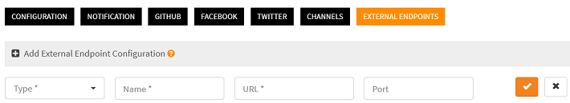
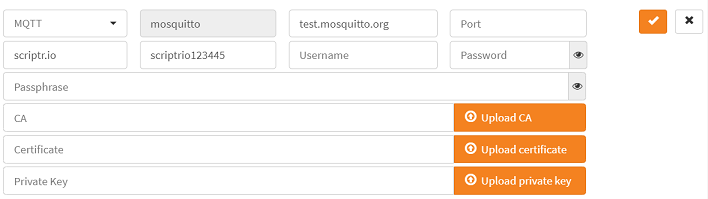

# How to publish a message to a remote mqtt topic from a script?

Very simple. This is what you need to do:

- Require the **mqtt** module
- Use the module to get an instance of the mqtt client for a given **endpoint configuration** (the remote mqtt broker you are targeting)
- Invoke the **publish()** method of the mqtt client, passing the topic and the message

For the sake of the example, we will use a [free online mqtt test broker](https://test.mosquitto.org/). You can replace it with any other mqtt broker you have access to.

## Publish using mqtt 

```
var mqtt = require("mqtt");
// no credentials are actually required for the remote test broker we're using in this example
var options = {username:"blah", password:"blah"}; 
var mqttClient = mqtt.getInstance("test.mosquitto.org", options); 
if (mqttClient.metadata) {
    return mqttClient;  // failure message
}

return mqttClient.publish("io.scriptr.mqtt", JSON.stringify({"fan":"on"}));
```

**Note**: the message you send should be a string, plain text or stringified JSON

## Publish using mqtts

When using mqtts, you will probably have to provide a client certificate, a root CA or both. These parameters, along with other optional parameters (username, password, key) are provided to the mqtt client through the **options** parameter of **mqtt.getInstance()** 

The free online broker we are using in these examples expects a root CA when connecting on port 8883. We will assume that our root CA file is attached to a document, which we will retrieve and pass to the mqtt client.

```
var document = require("document");
var mqtt = require("mqtt");
// In our example, the root CA file is persisted as an attached file of a document 
var file = document.getAttachment("mosquitto_ca", "mosquitto.org.crt", {fieldName:"apsdb_attachments", "versionNumber": "1"});
var options = {
  rootCa: file  
};
var mqttClient = mqtt.getInstance("mqtts://test.mosquitto.org:8883", options); // You should add the mqtts:// when using TLS
return mqttClient.publish("iotdemos.scriptr.io", JSON.stringify({"fan":"on"}));
```

## Can I reuse an endpoint configuration?

Sure,

You can create a reusable endpoint configuration from the workspace settings and refer to it by name every time you create an instance of an mqtt client:

```diff
- This feature is not accessible from a freemium account. You need to upgrade to a premium plan to use it -
```

### Create an mqtt endpoint configuration

- Open the [workspace](https://www.scriptr.io/workspace) and click on your username on the top right corner of the screen
- From the drop-down list, select **Settings** then click on the **External Endpoints** tab
- Click on +Add External Endpoint Configuration



*Image 1*

- Select MQTT from the **Type** drop-down (or select MQTTS)
- Enter a name in the **Name** field that will be used to identify the endpoint
- In the **URL** field, enter the URL of the mqtt broker to use (e.g. test.mosquitto.org)
- You can leave the **Port** field empty if the target broker is used the default ports (1883 for mqtt or 8883 for mqtts)
- In the **Topic**, enter the name of a topic to subscribe to, on the remote broker (if you are using the aforementioned test broker, just type any name - try to make it unique to avoid collisions with others, e.g. "com.yourcomany.mqtt") 
- In the **Username** and **Password** fields, respectively enter your username and password provided by the remote broker (if you are using the test broker, you do not have to fill this fields)
- In the Client id field, enter a unique identifier (to avoid collisions with others)
- If you have selected MQTTS, you might have to fill the CA, Certificate and Private Key fields, depending on the mqtt broker you are using)



*Image 2*

### Reuse an mqtt endpoint configuration

Everytime you need to publish to a topic related to a predefined endpoint, you only need to create an instance of an mqtt client specifying the endpoint name:

```
var mqtt = require("mqtt");
var mqttClient = mqtt.getInstance("mosquitto"); // just pass the name of the endpoint configuration
return mqttClient.publish("iotdemos.scriptr.io", JSON.stringify({"fan":"on"}));
```

# More

- Read more about the [mqtt.getInstance() options](https://www.scriptr.io/documentation#documentation-mqtt-getInstance-endpointgetInstance)
- Read more about how to [get attached files from documents](https://www.scriptr.io/documentation#documentation-get-attachmentgetAttachment)
