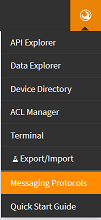

# How to subscribe a remote mqtt client to receive messages from my scriptr account?

Channels in your scriptr.io account can be used as MQTT topics and therefore, any message published to a channel can be conveyed to all the MQTT clients that are subscribed to that channel. To subscribe a remote MQTT client to one of your channels, all you need is to generate an mqtt username and password, as well as a topic name, derived from your channel.

Pre-requisites:
- Make sure you have [created a channel](../publish_subscribe/create_channel.md)
- It is preferrable that you [create a new device](../acl/create_devices_users.md) (otherwise, you can take the one by default - scriptr)

From your [workspace](https://www.scriptr.io/workspace), click the wrench icon on the top right corner of the screen, the select Messaging Protocols (**note**: this is a paid option that you can activate for a trial period. You need to request activation from scriptr.io and wait till you it is done before proceeding with this how-to).

In the messaging protocols configuration screen (below):

- In section 1 (protocol), select MQTT as the protocol (default)
- In section 2 (credentials), select one of your devices. Make sure to copy the generated username and password.
- In section 3 (publishing details), select one of your channels (the one you want your MQTT client to subscribe to). Make sure the value of Messaging topic.

**Note:** Section 4 automatically generates the mqtt inscrutions you could use with a Mosquitto MQTT client, by selecting the use case that matches your needs.
Don't hesitate to use this feature.

Now use the MQTT credentials you obtain to connect to the scriptr.io MQTT broker from your MQTT client, then use the Messaging topic value to subscrbibe to the channel.
