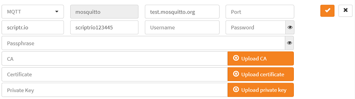
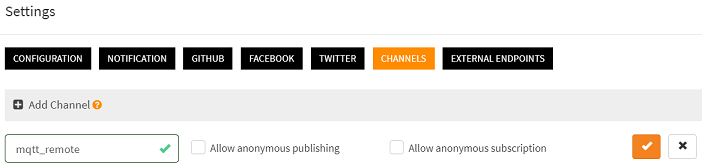
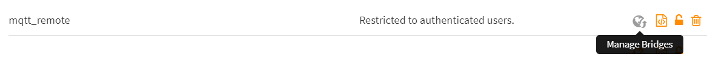
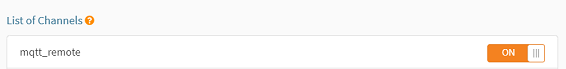

# How to subscribe one or many scripts to a remote mqtt topic?

Assume some devices are publishing data to a third party mqtt topic and say that you need to broadcast these messages to one or many of your scripts. The following steps tell you how to easily do that in scriptr:

- Create an mqtt endpoint
- Create a channel
- Create a bridge between the endpoint and the channel
- Subscribe the script(s) to the channel
- Read the incoming messages in the subscriber script

For the sake of the example, we will use a free [online mqtt test broker](https://test.mosquitto.org/). 
You can replace it with any other mqtt broker you have access to.

```diff
- This feature is not accessible from a freemium account. You need to upgrade to a premium plan to use it -
```

## Create an mqtt endpoint

- Open the [workspace](https://www.scriptr.io/workspace) and click on your username in the top right corner of the screen
- From the drop-down list, select **Settings** then click on the **External Endpoints** tab
- Click on +Add External Endpoint Configuration


*Image 1*

- Select MQTT from the **Type** drop-down (or select MQTTS)
- Enter a name in the **Name** field that will be used to identify the endpoint
- In the **URL** field, enter the URL of the mqtt broker to use (e.g. test.mosquitto.org)
- You can leave the **Port** field empty if the target broker is used the default ports (1883 for mqtt or 8883 for mqtts)
- In the **Topic**, enter the name of a topic to subscribe to, on the remote broker (if you are using the aforementioned test broker, just type any name - try to make it unique to avoid collisions with others, e.g. "com.yourcomany.mqtt") 
- In the **Username** and **Password** fields, respectively enter your username and password provided by the remote broker (if you are using the test broker, you do not have to fill this fields)
- In the Client id field, enter a unique identifier (to avoid collisions with others)
- If you have selected MQTTS, you might have to fill the CA, Certificate and Private Key fields, depending on the mqtt broker you are using)



*Image 2*

## Create a channel

A channel is a generic publish/subscribe mecanism. Scripts or remote clients can publish or subscribe to it using any of the supported messaging protocols (websockets, mqtt, amqp). Any published messages is automatically broadcast to all subscribers.

To create a channel:

- In the [workspace](https://www.scriptr.io/workspace), click on your username in the top-right corner of the screen and select **Settings**
- Click on the **Channels** tab then click "+Add Channel"
- Enter a name for your channel. Do not check the boxes if you do not want to authorize non authenticated (anonymous) subscriptions or publications



*Image 3*

## Create a bridge between the endpoint and the channel

The bridge uses the endpoint definition to subscribe to the remote topic and convey any received message to the channel, which will broadcast it to all of its subscriber. 

To create a bridge,  

- In the [workspace](https://www.scriptr.io/workspace), click on your username in the top-right corner of the screen and select **Settings**
- Click on the **Channels** tab then select one of your existing channels
- Click on the globe icon to manage the bridges for this channel



*Image 4*

- Select the endpoint configuration to use
- Specify an authentication token to use when conveying a message from the endpoint to your scripts (if needed, read [how to create devices and users](../acl/create_devices_users.md) and obtain a authentication token)
- Click on **Add Bridge**

## Subscribe the script(s) to the channel

You can subscribe a script to a channel in two different ways:

- From the user interface
- From the code of another script

### Subcribe a script to a channel from the user interface

- In the [workspace](https://www.scriptr.io/workspace), select the script you wish to subscribe to the channel, from the tree view on the left side of the screen
- In the editor area, click on the **Subscribe button**
- Subscribe to a channel by switching on the corresponding toggle



### Subcribing a script to a channel from the code of anoher script

Simply use the native **subscribe()** function in the code, passing the channel name and the absolute path to the script (**note**: do not start with "/")

```
// the below subscribed the "tutorials/howto/mqtt/subscriber" to the "mosquitto" channel
var resp = subscribe("mosquitto", "tutorials/howto/mqtt/subscriber");
```

## Read the incoming messages in the subscriber script

Depending on the format of the message that was published on the remote topic, you will be able to retrive it from the native **request.body** and/or **request.rawBody** objects. The former will hold any JSON payload, whereas the latter will hold anything that cannot be parsed as JSON (e.g. text or XML)

```
// This is the subscriber script
return {
    body: request.body, // JSON payload in mqtt message
    raw: request.rawBody // text or XML payload in mqtt message
};
```
# More

- [The pubsub module in scriptr](https://www.scriptr.io/documentation#documentation-publishsubscribemodulepubsubModule)
