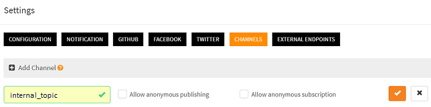
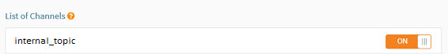

# How to broadcast data from one script to other scripts in my scriptr account?

This is very easy to do:
- First, you have to create a channel, (this is optional. If you've already created channels, you can reuse them)
- Subscribe the consumers scripts (the one receiving the data) to the channel
- Publish data from the producer script to the channel
- Consume the data, from the subscribers

## Create a channel

**Reminder**: this step is optional if you already have channels and wish to reuse them

A channel is a generic publish/subscribe mecanism. Scripts or remote clients can publish or subscribe to it using any of the supported messaging protocols (websockets, mqtt, amqp). Any published messages is automatically broadcast to all subscribers.
To create a channel:

- In the [workspace](https://www.scriptr.io/workspace), click on your username in the top-right corner of the screen and select **Settings**
- Click on the **Channels** tab then click "+Add Channel"
- Enter a name for your channel. Do not check the boxes if you do not want to authorize non authenticated (anonymous) subscriptions or publications



*Image 1*

## Subscribe the consumer scripts to the channel

You can subscribe a script to a channel in two different ways:

- From the user interface
- From the code of another script

### Subcribe a script to a channel from the user interface

- In the [workspace](https://www.scriptr.io/workspace), select the script you wish to subscribe to the channel, from the tree view on the left side of the screen
- In the editor area, click on the **Subscribe button**
- Subscribe to a channel by switching on the corresponding toggle



*Image 2*

### Subcribing a script to a channel from the code of anoher script

Simply use the native **subscribe()** function in the code, passing the channel name and the absolute path to the script (**note**: do not start with "/")

```
// the below subscribed the "tutorials/howto/publish_subscribe/subscriber" script to the "internal_topic" channel
var resp = subscribe("internal_topic", "tutorials/howto/mqtt/subscriber");
```

## Publish data from the producer script to the channel

From the publisher script, just use the native **publish()** function to publish to your channel:
```
publish("internal_topic", {"command": "set_target_temperature", "value":22, "unit":"C"});
```

## Consume the data, from the subscribers

Depending on the format of the message that was published on the channel, you will be able to retrieve it from the native **request.body** and/or **request.rawBody** objects. The former will hold any JSON payload, whereas the latter will hold anything that cannot be parsed as JSON (e.g. text or XML)

```
// This is the subscriber script, in this trivial code, it just returns anything it receives
return {
    body: request.body, // JSON payload in mqtt message
    raw: request.rawBody // text or XML payload in mqtt message
};
```
# More

- [The pubsub module in scriptr](https://www.scriptr.io/documentation#documentation-publishsubscribemodulepubsubModule)
