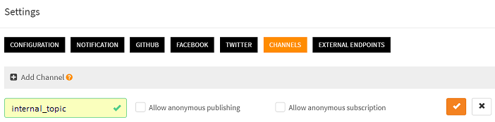

# How to create queued jobs?

Queued jobs are scripts that are put in a queue and that execute sequentially and asynchronously. There are many situations where an IoT application needs to create queued jobs, such as:

- When a remote client requests the execution of a lengthy operation and cannot wait for the answer
- When a script needs more time to execute than the maximum time allocated by scriptr
- When a script has to absorbe a sudden spike of requests issued by remote clients (e.g. devices)
- More generally, when batching makes more sense than a transactional behavior
- ...

Scriptr allows you to create queued jobs very easily, using the **queue** module. To create a queued job, apply the following steps:

- Create a channel that will be used as a queue
- Create the job (a script of which instances are put in the queue)
- Create the manager script (the script that puts jobs in the queue)

## Create a channel

**Reminder**: this step is optional if you already have channels and wish to reuse them

A channel is a generic publish/subscribe mecanism. Scripts or remote clients can publish or subscribe to it using any of the supported messaging protocols (websockets, mqtt, amqp). Any published messages is automatically broadcast to all subscribers.
To create a channel:

- In the [workspace](https://www.scriptr.io/workspace), click on your username in the top-right corner of the screen and select **Settings**
- Click on the **Channels** tab then click "+Add Channel"
- Enter a name for your channel. Do not check the boxes if you do not want to authorize non authenticated (anonymous) subscriptions or publications

*Image 1*

## Create the job

A job could be any script. For the sake of the example 
