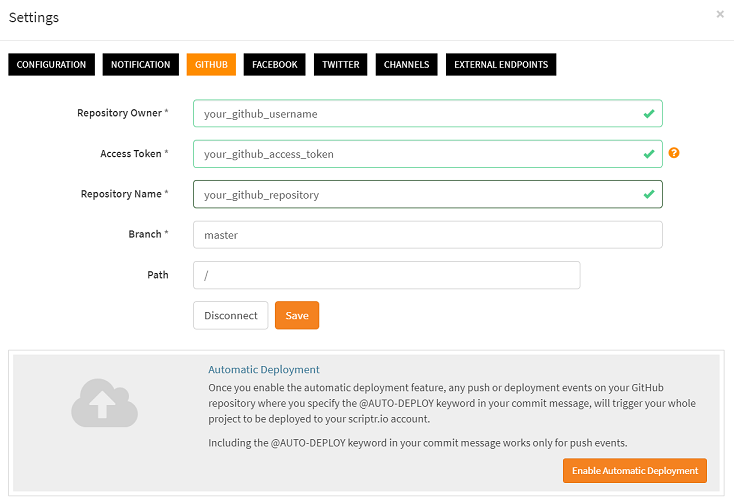
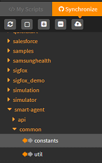
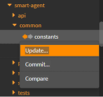
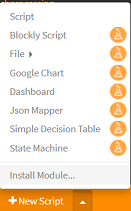
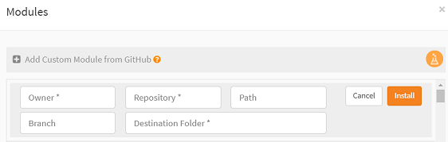

# How to control the versions of my application and scripts?

As soon as you start tackeling a level beyond tinkering, notably if you're engaged in projects involving multiple developers, resorting to a version control system becomes a must. That's why script natively integrates with Github, allowing you to place all your developments under version control.

## Connecting your scriptr account to Github

### Pre-requisites

- If you do not already have a account, please [sign-up to Github](https://github.com/) 
- If necessary, [create a new Github repository](https://help.github.com/articles/create-a-repo/)
- [Generate a personal access token from Github](https://help.github.com/articles/creating-a-personal-access-token-for-the-command-line/)

### Configure scriptr

- Open your [workspace](https://www.scriptr.io/workspace)
- Click on your username in the top-right corner of the screen, then click on **Settings** and select the **Github** tab

*Image 1*

- Fill in the **Repository Owner***, **Acess Token*** and **Repository Name** with their respective corresponding values: your Github username, you Github personal access token and the name of your repository. The **Branch** field is set by default to "master". You can replace its value with the name of another branch of your repository if needed. The **Path** contains the absolute path to the folder where the code resides in your scriptr account. It is set by default to the root folder ("/"). Therefore, the code in scriptr will be stored in /some_absolute_path/repository_name.
- Click **Save** when you're done

**Note**
If you wish to automatically reflect any change that is done on the repository, into your code, click on the **Enable Automatic Deployment** button. This is an interesting feature that notably proves useful when you need to simulatneously deploy an application on multiple scriptr accounts. 

### Github operations from the workspace

As soon as you connect to a Github repository, a synchronization takes place and the content of the repository is added to your workspace. For explicit synchronization, click on the **Synchronize** tab at the top of the treeview on the left

*Image 2*

Right-clicking an item on the synchronization view opens a drop-down list that exposes three possible actions:

- update: select this action to **replace the content of the selected script with the content of the script in the repository** 
- commit: select this action to push the changes in the selected script to update the script in the repository 
- compare: opens a comparison editor to see what differences exist between the workspace and the Github versions of the selected script

*Image 3*

## Importing code from other repositories

Once your scriptr account is configured to use Github, you can import code from repositories other than the one used in your configuration (these will be read-only, i.e. you won't be able to synchronize with them)

In order to import the content of a Github repository into your workspace, click on the arrown near **+New Script** in the bottom-left corner of the screen and select **Install module**

*Image 4*

Fill the fields of the Modules dialog: 

- Owner: the Github username of the repository owner
- Repository: the name of the repository to install code from
- Path: if you are targeting a subset of the repository, specify the path to the folder you need
- Branch: the targeted branch of the repository (master by default)
- Destination folder: the path in your workspace where to deploy the content of the repository

Click **Install** once done.

*Image 5*

# More 

Read more about the integration with Github in our [documentation](https://www.scriptr.io/documentation#documentation-github)
