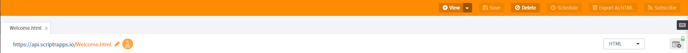
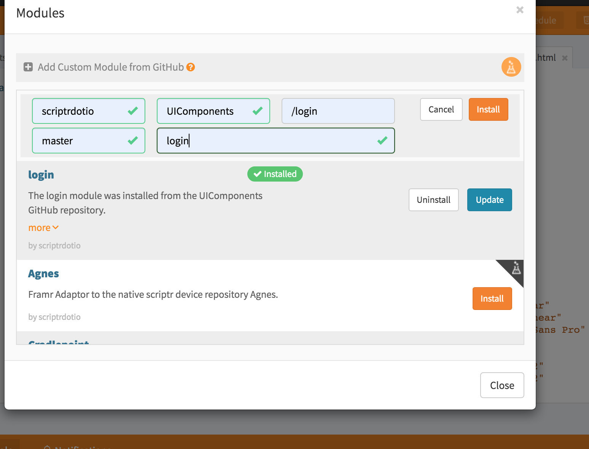
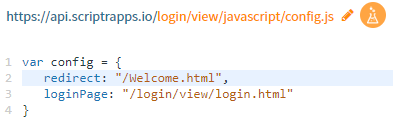
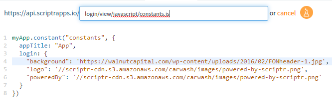
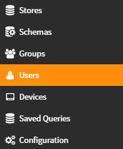
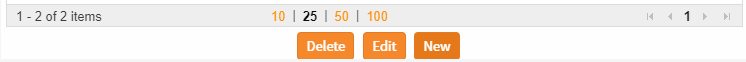

Hello and welcome to this series of tutorials from scriptr.io

<h1>Section 1 : login module</h1>


The login module is a quick and easy way to add a customizable login page along with “lost password” options. In this section we’ll create an empty page and add a login page to access it. 

**Create and or login to your Account**

First we need to login or create a free account on scriptr.io if you don’t have an account. \
You will need to confirm your email before being able to continue.

**Add Subdomain**


Next we need a scriptr.io subdomain to access the pages we create in our account. 

Navigate to account>subdomain (under username) then enter a unique subdomain.

**Change "Allow Not Binding To Referrer" to true**


We need this variable set to true, so let’s double check that it is .. 

Navigate to Tools>Data Explorer then Click on “Configuration”.

Check that **Allow Not Binding To Referrer ** is set to true otherwise set it to "true" and press Save in the bottom of the page.

Keep this tab open because we will need it later to create users who can login.

**Create a sample page**


Let’s create a simple hello world page. In the workspace tab click on the little arrow in the bottom and create  a new HTML page. Put any small content such as welcome to my page. Save the page as "Welcome.html"

Press on the view button to preview your page. 





**Add the Module to your app**


The module we want is on the page[ https://github.com/scriptrdotio/UIComponents](https://github.com/scriptrdotio/UIComponents) 

You’ll notice the owner is scriptrdotio repo is UIComponents. 

We’re interested in login , the master branch, and want to install it in a folder called login

Back in the workspace click on the arrow near **new script ** and select “Add custom module from github” and fill in the following information :

*   Owner : scriptrdotio
*   Repository : UIComponents
*   Path : /login
*   Branch : master
*   Destination Folder login , or other specific folder





Click install and wait for the installation to complete. 

**Configure the module**


We could simply go to the login/view/login.html and run it out of the box, we’ll get a generic page. We need to tell that page where to go if login is successful, we could also change the background.

There are two notable files in the login folder:


*   **login/view/javascript/config.js** :

    Will allows us to tell the login module where to go after login by changing the redirect variable. We could for example redirect the login module to the Welcome.html page we created.


​    





    _Note: Watch out for case sensitivity._

*   **login/view/javascript/constants.js :**

    This file allows us to set the background/icon/powered by .. \
I will set it to an image that I previously found online. 


​    





    _Note: elements are separated by a comma , and each value is a string (enclosed in either ' or ") _

**Create Users to allow login :**


If you still have the data explorer tab open go there, otherwise navigate to **tools->data explorer** then click on **Users** in the left pane. \





Click on **New **in the bottom and fill in a user such as admin/admin or demo/demo, press the **save **button. 




**Login to test **


In the workspace tab select login.html and press view to view it, then login with the user you created in the last paragraph. If the login is successful you will be redirected to the page set in the redirect variable .. if the login fails, go back to the data explorer page and double check the user and password.

**Modifying welcome.html**


Now that login redirects to welcome , we could modify welcome to redirect to the login screen if the user is not logged in (thus making it inaccessible unless the user is logged in. 

We’ll include login scripts, and then write a bit of code inside the script on welcome.

**Adding required libraries to our sample page:**


Open Welcome.html in the workspace IDE, first we’ll include the jquery cdn.


```html
<!-- jquery -->
<script src="//code.jquery.com/jquery-1.12.4.js"></script>
<script src="//code.jquery.com/ui/1.12.0/jquery-ui.js"></script>
<script src="//cdnjs.cloudflare.com/ajax/libs/jquery-cookie/1.4.1/jquery.cookie.min.js" ></script>
```


Then we’ll include the libraries and scripts from login:


```html
<!-- includes from the login page -->
<script src="/login/view/javascript/authorization.js"> </script>
<script src="/login/view/javascript/config.js"> </script>
```


If we take a peek at authorization.js we’ll see the widget we want to initialize .. and the parameters it’s expecting , in a javascript on the page we’ll initialize that widget: 

*   An empty function for onTokenValid. 
*   A link back to the login page to be used when the user is not logged in , we could pass a string “/login/view/login.html” but we already have it defined in config.js (in config.loginPage).
*   We set validateTokinApi to login.validateTokenApi (also in login) 

    ```javascript
    <script type="text/javascript">	
          	var authorization  = $.scriptr.authorization(
              	{
                      onTokenValid: function(){ },
                      loginPage: config.loginPage,
                      validateTokenApi: login.validateTokenApi
              	}
          	);
        </script>
    ```


The authorization widget keeps checking every X seconds if the token in the cookie is valid by calling the validate token api.

The number of seconds between each check is under **login/view/javascript/config.js **there is an expiry variable under login. 

The number of seconds a token remains valid is stated in the **configuration** section of the **Data Explorer** page , the variable is called **Default Token Expires ** and is normally set for 30 mins.

**Testing the page:**


*   Click on the view button to view the Welcome page, unless logged in the page should redirect to the login page.
*   If we leave the page too long it will logout by itself (default set to 30 mins)

**Code so far:**


Here’s  the code we have so far in Welcome.html

```html
<html>
    <head>
    	<title>sample app</title>  
	<!-- jquery -->
        <script src="//code.jquery.com/jquery-1.12.4.js"></script>
    	<script src="//code.jquery.com/ui/1.12.0/jquery-ui.js"></script>
    	<script src="//cdnjs.cloudflare.com/ajax/libs/jquery-cookie/1.4.1/jquery.cookie.min.js" ></script>
    	<!-- login module includes -->
    <script src="/login/view/javascript/authorization.js"></script>
    <script src="/login/view/javascript/config.js"></script>
    
    <script>
    	var authorization = $.scriptr.authorization(
            {
	    onTokenValid:function(){},
                loginPage : config.loginPage ,
                validateTokenApi: login.validateTokenApi
            }
        );
    
    </script>
    </head>
    <body>
        <h1>Welcome to my site</h1>
    </body>
</html>
```
