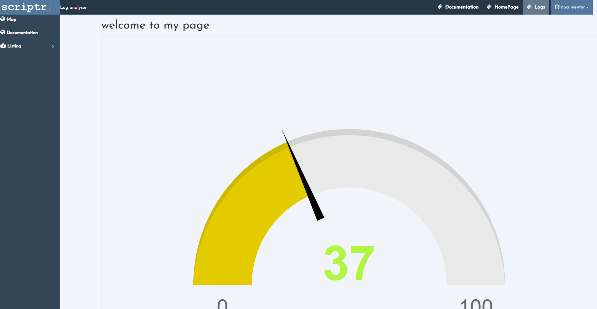

<h2>UIComponents Tutorial</h2>


<h3>Introduction</h3>


The UIComponents library is a handy way for us to quickly build a webapp with easy to add components which communicates with scriptr.io .

We’ll use the webpage created in the previous sections and create a simple webapp with it, that will have elements such as a header, with elements that are visible depending on the role of the logged in user, a menu on the left, we’ll briefly explain routing and controllers, add a couple of pages and learn how to embed and send data to a widget. 

If you haven’t seen the login page tutorial and don’t wish to cover it, you can create a blank html page and disregard login related information in the beginning of this tutorial, but it makes more sense to go back and check the short and quick login module tutorial .

Here’s a preview of what we will build. 





First we’ll move “welcome.html” to **_/app/view/html _**then change**_ /login/view/javascript/config.js _** to reflect that change.  \
This is just to follow a standard used by scriptr.io for websites, where all view entries reside in that folder, javascript resides in **_/app/view/javascript_** we can see this structure reflected in the login module.  \
Press run to test login and make sure everything is working as expected

<h3>Installing requirements</h3>


We will rely on the underscore module. Click on the arrow next to the **newscript **button, then on “**install module**”.  \
Scroll to underscore and install the module. You can read more about it on [http://underscorejs.org/](http://underscorejs.org/) .

Adding the underscore module allows us to use it as a required module in the scripting API.

Then we’ll install the UIcomponent module the same way we did with the login module: \
Click on the same **install module **button then on **add a custom module from github,** enter the following parameters: 

_Owner : scriptrdotio	Repository : UIComponents	Path : /UIComponents	Branch : master_

The destination folder we recommend is **UIComponent **to follow the tutorial more easily. 


<h3>Adding Header to welcome</h3>


Before we start open the link **_UIComponents/layout/frontend/examples/header/demoHeader.html _**

That page makes use of the  **header-top** tag and works as a good demo, example of things we need. 

Press view to see this page and what the header looks like .  \


Each component in the UIComponent, including widgets like these, is thoroughly documented.  \
You can read the header documentation, for example, at the following link: [https://github.com/scriptrdotio/UIComponents/tree/master/UIComponents/layout/frontend/components/header](https://github.com/scriptrdotio/UIComponents/tree/master/UIComponents/layout/frontend/components/header)

Let’s copy the required scripts into Welcome.html:

We’ll start with a minified bootstrap.


```html
<!-- Latest compiled and minified CSS -->
<link rel="stylesheet" href="//maxcdn.bootstrapcdn.com/bootstrap/3.3.7/css/bootstrap.min.css" integrity="sha384-BVYiiSIFeK1dGmJRAkycuHAHRg32OmUcww7on3RYdg4Va+PmSTsz/K68vbdEjh4u" crossorigin="anonymous">
<!-- Optional theme -->
<link rel="stylesheet" href="//maxcdn.bootstrapcdn.com/bootstrap/3.3.7/css/bootstrap-theme.min.css" integrity="sha384-rHyoN1iRsVXV4nD0JutlnGaslCJuC7uwjduW9SVrLvRYooPp2bWYgmgJQIXwl/Sp" crossorigin="anonymous">
```


Then font-awesome and google font (both optional but recommended for nicer looking results).


```html
<!-- font awesome.css -->
<script src="https://use.fontawesome.com/e52656d6f6.js"></script>
<link href="//fonts.googleapis.com/css?family=Josefin+Sans|Montserrat" rel="stylesheet">
```


We should have all the jquery scripts already (used with the login module) , if you don’t have them copy the following scripts before you continue


```html
    <!-- jquery -->
    <script src="//code.jquery.com/jquery-1.12.4.js"></script>
    <script src="//code.jquery.com/ui/1.12.0/jquery-ui.js"></script>
    <script src="//cdnjs.cloudflare.com/ajax/libs/jquery-cookie/1.4.1/jquery.cookie.min.js" ></script>
```


Then we copy the underscore, angular libraries and modules.


```html
<!-- external libraries -->
<script src="//cdnjs.cloudflare.com/ajax/libs/underscore.js/1.8.3/underscore-min.js"></script>	
<script src="//ajax.googleapis.com/ajax/libs/angularjs/1.5.6/angular.min.js"></script>
<script src="//ajax.googleapis.com/ajax/libs/angularjs/1.5.6/angular-cookies.js"></script>
<script src="//ajax.googleapis.com/ajax/libs/angularjs/1.5.6/angular-route.js"></script>
<script src="//ajax.googleapis.com/ajax/libs/angularjs/1.5.8/angular-animate.js"></script>
<script src="//ajax.googleapis.com/ajax/libs/angularjs/1.5.8/angular-sanitize.js"></script>
<script src="//angular-ui.github.io/bootstrap/ui-bootstrap-tpls-2.4.0.js"></script>
```


We will include scripts from UIComponents, specifically** module.js** which contains modules we need, and **header.js** which contain the header. Finally we’ll also include the header.css to make the header look nicer.


```html
<!-- UIComponents -->
<script src="/UIComponents/layout/frontend/components/module.js"></script>
<script src="/UIComponents/layout/frontend/components/header/header.js"></script>
<link rel="stylesheet" href="/UIComponents/layout/frontend/components/header/header.css">
```


Inside the <script> section of welcome.html, we’re going to add the following to make underscore more accessible to angular libraries. 

```javascript
          var underscore = angular.module('underscore',  []);
          	  underscore.factory('_', ['$window', function($window) {		
              return $window._; // assumes underscore has already been loaded on the page		
          }]);
```


And then myapp (as an angular application) using the Layout service


```javascript
var myApp = angular.module('myApp', ["Layout"]);
```


But for this to work we need to define a new angular app, we’ll define the whole page as myApp. To do that jump up to the top of the page and change the **<html> ** tag to  **<html ng-app="myApp"> ** .

Let’s then add the header controller to myApp in script and to the body, first in script with :


```javascript
angular.module('myApp').controller('headerCtrl', function($scope, $sce) {
    var vm = this;  
});	
```


Then by changing **<body>** to **<body  ng-controller="headerCtrl as vm">** . Note that we can set the controller in any tag enclosing header-top. Body is the most convenient one to use now.

If you’re new to AngularJS you might wonder what it is, in which case the simplest thing to know is that controllers pass and process data to your view/page.  \


Now we can add the header-top tag to our welcome page but if we look at bindings in headers.js ,or look at the previously mentioned [documentation for header](https://github.com/scriptrdotio/UIComponents/tree/master/UIComponents/layout/frontend/components/header) , we’ll see it requires headerItems and user.

The user can only access this page if they are logged in and hence have their info in the cookie so we’ll put the following line under var vm=this, which reads the user info from the cookie and stores it in vm.user . Note that we can use **this.user** and forgo **vm=this** but to remain consistent with the uiComponent standard practice. 


```javascript
vm.user = JSON.parse($.cookie('user'));
```


Then pass that variable to the header-top tag, alongside another variable called **myItems** which we will define next.  


```html
<header-top  user="vm.user" header-items='vm.myItems' ></header-top>
```


Now we need to define **myItems **these will be the items/links that appear in the navigation header, back in the script let’s add the following under it:


```javascript
vm.myItems = {
              "items": [
                {"icon": "fa fa-ticket", "label": "Documentation", "route":"#/documentation", "class": "pull-left"},
                {"icon": "fa fa-ticket", "label": "API Explorer", "route":"#/apiexplorer", "class": "pull-left"},
                {"icon": "fa fa-ticket", "label": "Logs", "route":"#/logs", "class": "pull-left", 
                  "subitems": [
                       {"icon": "fa fa-ticket", "label": "submenu1", "route":"#/submenu1", "class": "pull-left"},
                       {"icon": "fa fa-ticket", "label": "submenu2", "route":"#/submenu2", "class": "pull-left"}
                  ]
                }
              ],
              "subitems": [
                {"icon": "fa fa-ticket", "label": "Settings", "route":"#/settings", "class": "pull-left"},
               ],                      
              "appname": "Log analyser",
               "logout": {"icon": "fa fa-sign-out", "label": "Logout", "route":"#/logout"}
            };
```


From the bottom up :

*   The **logout item**, if mentioned, will be included as a subitem by default (drops down from user), 
*   Any other **subitems **on this level will be bundled with the logout, in this case settings will appear above logout. 
*   **Items** will be displayed on the top navigation bar, like documentation in this scenario, any one of them may optionally have it’s own **subitems **such as logs which has submenu’s 1 and 2.

Entries optionally have an **icon **or a **class**, we can also specify the **role**/**group** of users capable of seeing this entry, every entry must have a **label **to be displayed. 

**route **tells the code where to go when the label is clicked, and we will explain this in more details next.


<h3>Where the pages will load</h3>

If you’re not familiar with AngularJS, one of the things you should know about it is that in angular, generally, there is a single page used to load views inside it without reloading the page, also called SPA or single page application .  

The directive with which those pages (or subpages) are loaded is called **ng-view . **

You can read more about it here [https://docs.angularjs.org/api/ngRoute/directive/ngView](https://docs.angularjs.org/api/ngRoute/directive/ngView) .

Loading pages is handled by the routeProvider, an angularJS provider(service) which gets instantiated at app initialization .  
It is part of the **ngRoute **module [https://docs.angularjs.org/api/ngRoute/provider/$routeProvider](https://docs.angularjs.org/api/ngRoute/provider/$routeProvider).

In order for any page to support loading views , both the ngRoute provider and an ng-view Tag must be declared on webapp. 

We’ll need to add a config to our application and pass $routeProvider as parameter, and the function that will fire when a link is clicked on the page. More information can be found in the above links, a simple tutorial can be found on the w3cSchool link [https://www.w3schools.com/angular/angular_routing.asp](https://www.w3schools.com/angular/angular_routing.asp) 

A quick example from the w3school page:


```javascript
app.config(function($routeProvider) {
  $routeProvider
  .when("/", {
	templateUrl : "main.htm"
  })
  .when("/london", {
	templateUrl : "london.htm"
  })
  .when("/paris", {
	templateUrl : "paris.htm"
  });
});
```


When a link is clicked such as `"route":"#/documentation"` defined in the previous section, the routeProvider will match it to the proper route and use the appropriate template. We’ll create those templates that will be loaded inside **ng-view**. 

<h3>Managing routes and connecting logout</h3>


You probably noticed that clicking on the navigation link does nothing right now, we want it to load a subpage inside welcome after we add the aforementioned ng-view and we will create those pages in a bit, but we’ll start by connecting the logout button so the users can log out when they click on it.

Next we’ll add the ngRoute service to myApp:


```javascript
var myApp = angular.module('myApp', ["Layout","ngRoute"]);
```


Next we’ll add a constant to myApp called routingJson which we will set to be an object with params, each param has the route name, that matches the route name in the myItems, and the template that will be used. 

For now though we’ll create an entry with “route”:”logout” which points to the logout.html page found in the view folder of the logout module 


```javascript
myApp.constant("routingJson",  {
    "params": [
        {"route": "logout", "template": "/login/view/logout.html"},  
     ]
});
```


Next we’ll add a function to the app config, this function will iterate over the params until it matches with a route and uses that route’s template :


```javascript
myApp.config(function($routeProvider, routingJson){
    for(var i = 0; i < routingJson.params.length; i++){
        $routeProvider
            .when("/" + routingJson.params[i].route, {
            templateUrl: routingJson.params[i].template
        })
    }
});
```


Save and click on the view button, then test the logout button.

<h3>Adding a documentation page</h3>


Next let’s add a documentation page; we could create any page but we’ll make use of the documentation link we have in the header to create a page for it. \


We’ll put it in a folder called documentation under view/html, this will allow us to add css and other related scripts in the same folder if we need them, remember to click on the arrow and select FILE->HTML

Put whatever you want in the documentation.html and save it.

Back in the Welcome.html page we already have the navigation button in myItems, let’s add the route to the constant


```javascript
myApp.constant("routingJson",  {
   "params": [
      {"route": "documentation", "template": "/app/view/html/documentation/documentation.html"},
      {"route": "logout", "template": "/login/view/logout.html"},  
   ]
});
```


Let’s add the ng-view, I replaced the previous message for now, we’ll show the welcome message later. \


```html
    <body ng-controller="headerCtrl as vm">
        <header-top header-items='vm.myItems' user="vm.user"></header-top>        
        <div>&nbsp;</div>
        <section>
            <div class="page-content">
            	<ng-view>
                </ng-view>
            </div>
        </section>
    </body>
```


<h3>Adding a controller for the documentation page</h3>


  Our document page doesn’t really have any data but for the sake of example we’ll pretend it does and add a controller to manage said data. 

Let’s add a basic controller for “document” on the welcome page, we’ll show you how to better organize the code in a bit. 

We’ll add a controller to myApp, we can name it anything we want, I used `documentationCtrl`, we’ll set 2 variables here, `vm.title ` and `vm.text` that we will display on the documentation page. At the end of the script add :


```javascript
            angular.module('myApp').controller('documentationCtrl', function($scope) {
                var vm = this;
                vm.title = "This is the documentation title ";
                vm.text = "This is the documentation text";
            })
```


 \
Open your document’s html page .. we’ll need to define an app, attach the controller and post the variables .. this is how i modified mine :


```html
<div ng-app="myApp" ng-controller="documentationCtrl as vm">
    <h1>Documentation</h1>
    <h2>{{vm.title}}</h2>
    <div>
        <p>{{vm.text}}</p>
    </div>
</div>
```


Go back to the welcome page. Press view, login if you need to then click on documentation. The page should change and look like this if your code is similar to mine.


<h3>Code so far : welcome.html with header</h3>


This is the Welcome code we have so far in case you had trouble with yours:


```html
<html ng-app="myApp">
    <head>
    <title>sample app</title>
        <!-- Latest compiled and minified CSS -->
        <link rel="stylesheet" href="//maxcdn.bootstrapcdn.com/bootstrap/3.3.7/css/bootstrap.min.css" integrity="sha384-BVYiiSIFeK1dGmJRAkycuHAHRg32OmUcww7on3RYdg4Va+PmSTsz/K68vbdEjh4u" crossorigin="anonymous">
        <!-- Optional theme -->
        <link rel="stylesheet" href="//maxcdn.bootstrapcdn.com/bootstrap/3.3.7/css/bootstrap-theme.min.css" integrity="sha384-rHyoN1iRsVXV4nD0JutlnGaslCJuC7uwjduW9SVrLvRYooPp2bWYgmgJQIXwl/Sp" crossorigin="anonymous">
        <!-- font awesome.css -->
        <script src="https://use.fontawesome.com/e52656d6f6.js"></script>
        <link href="//fonts.googleapis.com/css?family=Josefin+Sans|Montserrat" rel="stylesheet">
        <!-- font awesome.css -->

        <!-- jquery -->
        <script src="//code.jquery.com/jquery-1.12.4.js"></script>
    	<script src="//code.jquery.com/ui/1.12.0/jquery-ui.js"></script>
    	<script src="//cdnjs.cloudflare.com/ajax/libs/jquery-cookie/1.4.1/jquery.cookie.min.js" ></script>
        
        <!-- external libraries -->
    	<script src="//cdnjs.cloudflare.com/ajax/libs/underscore.js/1.8.3/underscore-min.js"></script>	
    	<script src="//ajax.googleapis.com/ajax/libs/angularjs/1.5.6/angular.min.js"></script>
      	<script src="//ajax.googleapis.com/ajax/libs/angularjs/1.5.6/angular-cookies.js"></script>
        
        <script src="//ajax.googleapis.com/ajax/libs/angularjs/1.5.6/angular-route.js"></script>
        <script src="//ajax.googleapis.com/ajax/libs/angularjs/1.5.8/angular-animate.js"></script>
        <script src="//ajax.googleapis.com/ajax/libs/angularjs/1.5.8/angular-sanitize.js"></script>
        <script src="//angular-ui.github.io/bootstrap/ui-bootstrap-tpls-2.4.0.js"></script>
        
       
        
        <!-- UIComponents -->
        <script src="/UIComponents/layout/frontend/components/module.js"></script>
        <script src="/UIComponents/layout/frontend/components/header/header.js"></script>
        <link rel="stylesheet" href="/UIComponents/layout/frontend/components/header/header.css">
        <!-- includes from the login page -->
        <script src="/login/view/javascript/authorization.js"> </script>
    	<script src="/login/view/javascript/config.js"> </script>

        <script type="text/javascript"> 
            
          var authorization  = $.scriptr.authorization(
              {
                  onTokenValid: function(){ }, 
                  loginPage: config.loginPage,
                  validateTokenApi: login.validateTokenApi
              }
          );
            
          var underscore = angular.module('underscore',  []);
          	  underscore.factory('_', ['$window', function($window) {		
              return $window._; // assumes underscore has already been loaded on the page		
          }]);
            
      	  var myApp = angular.module('myApp', ["Layout","ngRoute"]);
            
          angular.module('myApp').controller('headerCtrl', function($scope, $sce) {
            var vm = this;  
            vm.myItems = {
              "items": [
                {"icon": "fa fa-ticket", "label": "Documentation", "route":"#/documentation", "class": "pull-left"},
                {"icon": "fa fa-ticket", "label": "Logs", "route":"#/logs", "class": "pull-left", 
                  "subitems": [
                       {"icon": "fa fa-ticket", "label": "submenu2", "route":"#/submenu2", "class": "pull-left"}
                  ]
                }
              ],
              "subitems": [
                {"icon": "fa fa-ticket", "label": "Settings", "route":"#/settings", "class": "pull-left"},
               ],                      
              "appname": "Log analyser",
               "logout": {"icon": "fa fa-sign-out", "label": "Logout", "route":"#/logout"}
            };
              
           vm.user = JSON.parse($.cookie('user'));
         });	
            
         myApp.constant("routingJson",  {
              "params": [
                {"route": "documentation", "template": "/app/view/html/documentation/documentation.html"},
                {"route": "logout", "template": "/login/view/logout.html"},  
              ]
            });
            
          myApp.config(function($routeProvider, routingJson){
            for(var i = 0; i < routingJson.params.length; i++){
              $routeProvider
                .when("/" + routingJson.params[i].route, {
                templateUrl: routingJson.params[i].template
              })
            }
           });
            
            angular.module('myApp').controller('documentationCtrl', function($scope) {
                var vm = this;
                vm.title = "This is the documentation title ";
                vm.text = "This is the documentation text";
            })
          </script>
	</head>
    <body  ng-controller="headerCtrl as vm">
        <header-top header-items='vm.myItems' user="vm.user"></header-top>
        <section>
            <div class="page-content">
            	<ng-view>
                </ng-view>
            </div>
        </section>
    </body>
</html>
```


<h3>Alternate method to add controllers</h3>


There is a better way of using controllers for our documents example, instead of declaring `'documentationCtrl'` in the html file,

Another way to do this is to add `'documentationCtrl'` to the “params” field in myApp.constants, in the following manner:


```javascript
{"route": "documentation", "template": "/app/view/html/documentation/documentation.html", "controller": "documentationCtrl as vm"},
```


Then add controller under templateUrl in the function making use of routeProvider:


```javascript
myApp.config(function($routeProvider, routingJson){
            for(var i = 0; i < routingJson.params.length; i++){
              $routeProvider
                .when("/" + routingJson.params[i].route, {
                templateUrl: routingJson.params[i].template,
                controller: routingJson.params[i].controller,
              })
            }
         });
```


Finally we can remove the controller declaration from the documentation.html page.


```html
<div ng-app="myApp" ng-controller="documentationCtrl as vm">
    <h1>Documentation</h1>
    <h2>{{vm.title}}</h2>
    <div>
        <p>{{vm.text}}</p>
    </div>
</div>
```


<h3>Add a default page when the route is not defined</h3>


We previously removed the “welcome to my page” text from welcome, let’s create a new page called homepage.html under 

**app/view/html/homepage/homepage.html ** and we’ll fill it with a simple welcome message or anything you want.


```html
<h1>welcome to my page</h1>
```


After we add the appropriate route to  `routingJson` in my case i added:


```json
{"route": "welcome","template":"/app/view/html/homepage/homepage.html"},
```


We’re going to tell the function cycling on the routes to default to this route with **otherwise** at the end of the **when** in:

```javascript
myApp.config(function($routeProvider, routingJson){ 
            for(var i = 0; i < routingJson.params.length; i++){ 
              $routeProvider 
                .when("/" + routingJson.params[i].route, { 
                templateUrl: routingJson.params[i].template, 
                controller: routingJson.params[i].controller, 
              }) 
            }
            $routeProvider.otherwise("/welcome");
    });
```

Click to preview page, after login or refresh the “welcome to my page” message should appear.

<h3>Adding a menu</h3>


Adding a menu is as simple as adding a header, and similarly to the header demo page, there is a menu example page under 

**UIComponents/layout/frontend/examples/menu/demoMenu.html** .  \
There is also a lot of documentation to be found in the component’s readme under: [https://github.com/scriptrdotio/UIComponents/tree/master/UIComponents/layout/frontend/components/menu](https://github.com/scriptrdotio/UIComponents/tree/master/UIComponents/layout/frontend/components/menu) 

One of the main differences between header and menu is that, when it comes to menu, we define columns; one of these columns has to be set as default, other columns can be set as submenu items (that unfold to the right when the item is clicked). In the demo page for example, clicking on “**Listing**” will unfold a column to the right with “**Logs**”, “**Historical**”, “**Tickets**”.

Let’s add the scripts required by the menu and the stylesheet.


```html
<link rel="stylesheet" href="/UIComponents/layout/frontend/components/menu/menu.css">
<script src="/UIComponents/layout/frontend/components/menu/menu.js"></script>
```


For the sake of variety, we’ll define a constant and append that constant inside the controller which will use the data to build the menu.


```javascript
myApp.constant("menuItemsJson",  {
            "mainMenu": "col1",
            "col1": [
                {"id":"3", "iconClass":"fa fa-globe", "label": "Map", "route":"#/map", "active":"false"},
                {"id":"4", "iconClass":"fa fa-globe", "label": "Documentation", "route":"#/documentation", "active":"true"},
                {"id":"5","iconClass":"fa fa-dashboard","label":"Listing","route":"#/load", "active":"false", "sub": "col2"},
            ],
            "col2": [
              {"id":"6", "iconClass":"fa fa-dashboard", "label":"Logs", "route":"#/logs", "active":"false"},
              {"id":"7", "iconClass":"fa fa-line-chart", "label": "Historical", "route":"#/hist", "active":"false"},
              {"id":"8", "iconClass":"fa fa-ticket", "label":"Tickets", "route":"#/tickets", "active":"false"}
            ]
          }).controller('menuCtrl', function($scope, menuItemsJson) {
            var vm = this 
            vm.menuItems = menuItemsJson
         });
```


Note that similarly to the way we defined the header items we could have defined `vm.menuItems={"mainMenu": "col1",...});`

As mentioned previously we defined `"col1" `and `"col2"`, we set col1 as our `"mainMenu"`, and used col2 as a submenu of `"Listing"`.

Next we’ll place the menu item in the HTML section, i used bootstrap rows/columns to organize the page a bit better, just as before we’ll pass **menu-items** we will enclose it inside a div that specifies `'menuCtrl'`  as it’s controller. 


```html
    <body  ng-controller="headerCtrl as vm">
        <div class="row">
        		<header-top header-items='vm.myItems' user="vm.user"></header-top>
        </div>
        <div class="row" style="padding-top:40px">
            <div class="col-sm-2" style="padding:0px">
                <div ng-controller="menuCtrl as vm">
                    <!-- menu items can also be passed as a json object directly here -->
                    <menu class="menu-wrap" menu-items="vm.menuItems"></menu>
                </div>
        	</div>
            <div class="col-sm-10">
                <div class="page-content">
                    <ng-view>
                    </ng-view>
                </div>
            </div>
        </div>
    </body>
```


Finally we’ll define a user variable in the controller the same way we did in the header, and pass it as an argument in the menu tag. 


```javascript
myApp.controller('menuCtrl', function($scope, menuItemsJson) {
    var vm = this 
    vm.menuItems = menuItemsJson;
    vm.user = JSON.parse($.cookie('user'));
});
```


```html
<menu class="menu-wrap" menu-items="vm.menuItems" user="vm.user"></menu>
```


<h3>Adding roles</h3>


In this next section we will update the code to show different things to two different users each with a different level of access.

Go to the **Data Explorer** page again (**Tools->Data Explorer**), click on **Groups **and create two groups “users” and “documenters”.

Then click on **Users ** and create two new users, “user” and “documenter”, make sure they belong to the correct group.

If you type a group that doesn’t exist an error message will appear. 

You’ll notice that a  single user can belong to more than one group, edit the original user we created for this example and make them part of both groups.


Now we'll move on to hiding header items depending on who is logged in. Back in the **Welcome.html **page modify the documentation entry in **vm.myItems** to make it accessible only to the documenter role:


```json
{"icon": "fa fa-ticket", "label": "Documentation", "route":"#/documentation", "class": "pull-left", "roles":["documenters"]},
```


Now login with “user” (or the account that doesn’t belong to the **documenters **group), the documentation link in the header should have disappeared. The menu link is still visible and the page is still accessible via direct link in the URI. 

Let’s do the same thing for the **menuItemsJson.**


```json
{"id":"4", "iconClass":"fa fa-globe", "label": "Documentation", "route":"#/documentation", "active":"true","roles":["documenters"]},
```


Refresh the page or login again and the documentation link in the menu will disappear. The page is still accessible however through the URL, if you replace **app/view/html/welcome.html#/welcome** with **app/view/html/welcome.html#/documentation** .

To remedy that situation, go back to the workspace and open **app/view/html/documentation/documentation.html**,

 Click on the Access Control List (the icon next to the word HTML)


Select documenters and press **Add** 


Documenters will now replace **anonymous** .. press **Save Changes.**

Now try to reload the documentation page, you should not be able to view it’s content even with direct access.

<h3>A little bit of housekeeping </h3>


Before we carry on let’s organize the code a little, there are standards we like to use when designing a new app, and we recommend you follow along. 

We store header/menu items and routes in **layout.js**, create a new JS file **app/view/javascript/layout.js**

And copy the appropriate items into the following variables : headerItems, MenuItems and routingItems.


```javascript
var menuItems = {
            "mainMenu": "col1",
            "col1": [
                {"id":"3", "iconClass":"fa fa-globe", "label": "Map", "route":"#/map", "active":"false"},
                {"id":"4", "iconClass":"fa fa-globe", "label": "Documentation", "route":"#/documentation", "active":"true","roles":["documenters"]},
                {"id":"5","iconClass":"fa fa-dashboard","label":"Listing","route":"#/load", "active":"false", "sub": "col2"},
            ],
            "col2": [
              {"id":"6", "iconClass":"fa fa-dashboard", "label":"Logs", "route":"#/logs", "active":"false"},
              {"id":"7", "iconClass":"fa fa-line-chart", "label": "Historical", "route":"#/hist", "active":"false"},
              {"id":"8", "iconClass":"fa fa-ticket", "label":"Tickets", "route":"#/tickets", "active":"false"}
            ]
          }

var headerItems = {
              "items": [
                {"icon": "fa fa-ticket", "label": "Documentation", "route":"#/documentation", "class": "pull-left", "roles":["documenters"]},
                {"icon": "fa fa-ticket", "label": "HomePage", "route":"#/homepage", "class": "pull-left"},
                {"icon": "fa fa-ticket", "label": "Logs", "route":"#/logs", "class": "pull-left", 
                  "subitems": [
                       {"icon": "fa fa-ticket", "label": "submenu1", "route":"#/submenu1", "class": "pull-left"},
                       {"icon": "fa fa-ticket", "label": "submenu2", "route":"#/submenu2", "class": "pull-left"}
                  ]
                }
              ],
              "subitems": [
                {"icon": "fa fa-ticket", "label": "Settings", "route":"#/settings", "class": "pull-left"},
               ],                      
              "appname": "Log analyser",
               "logout": {"icon": "fa fa-sign-out", "label": "Logout", "route":"#/logout"}
};

var routingItems = {
              "params": [
                {"route": "documentation", "template": "/app/view/html/documentation/documentation.html", "controller": "documentationCtrl as vm"},
                {"route": "welcome","template":"/app/view/html/homepage/homepage.html"},
                {"route": "logout", "template": "/login/view/logout.html"},  
              ]
            }
};
```


Now we link the layout.js script and replace the variables where necessary. 


```html
<!-- Includes from this App -->
<script src="../javascript/layout.js"> </script>
[...]
vm.myItems = headerItems;
[...]
myApp.constant("routingJson",  routingItems);
[...]
myApp.constant("menuItemsJson", menuItems)
```


Refresh or re-login to the page to make sure everything is still working as expected

Next we’ll move the controllers to controllers.js, move the following code to **app/view/javascript/controller.js**  


```javascript
angular.module('myApp').controller('headerCtrl', function($scope, $sce) {
	var vm = this;  
    vm.myItems = headerItems;          
 	vm.user = JSON.parse($.cookie('user'));
});	


angular.module('myApp').controller('documentationCtrl', function($scope) {
    var vm = this;
    vm.title = "This is the documentation title ";
    vm.text = "This is the documentation text";
});


myApp.controller('menuCtrl', function($scope, menuItemsJson) {
    var vm = this 
    vm.menuItems = menuItemsJson
});
```


When including this script, make sure you include it after the definition of myApp (after the <script> for example or at the end of body)

Next we’ll move the constants to **app/view/javascript/constants.js** :


```javascript
myApp.constant("routingJson",  routingItems);
myApp.constant("menuItemsJson", menuItems )
```


<h3>Looking at a sample widget </h3>


UIComponents also provide cool widgets like maps, charts and other visual data representations.

There are many examples of these inside the folders, such as the thermometer and the gauge.

In the workspace open **UIComponents/dashboard/frontend/examples/gauge/gaugeDemo.html**

Press view to see it . if you don’t see anything on the page it’s because you need to configure **scriptrTransport.js**, which you can see referenced on that page, so open **/UIComponents/config/scriptrTransport.js** . 

Widgets communicate with their data source either through websocket or direct http, the script transport provides the configuration that allows that communication, we need to set 2 sets of variables in the transport script.

**wsClientProvider.setBaseUrl,wsClientProvider.setToken **and **httpClientProvider.setBaseUrl, httpClientProvider.setToken**

The base URL is the one we set earlier as a subdomain, and the token we’ll use is the anonymous token both of which can be found by clicking on the [user name] (top left) -> Account.


Copy paste this data where it’s needed and save. 
Next let’s make sure the responseChannel is defined . Click on the [User name] -> Settings 
Select the Channels tab, make sure the following channel exists: **responseChannel**. 


If it isn’t click on “Add Channel” an fill the following then press the save tick button: 


Go back to **gaugeDemo.html **and press view to test it. The page should show a gauge with a value now. 

 

You may be wondering where the data/value of the widget  is coming from, there are multiple ways to set it 
The first one is directly when you declare the widget. 


```html
<scriptr-gauge  data=45 
...
</scriptr-gauge>
```


The second and most recommended method for many reasons including legibility and scalability is to fill the value from a separate backend script or logic using :


```html
<scriptr-gauge 
api='UIComponents/dashboard/frontend/examples/gauge/getGaugeVal'
</scriptr-gauge>
```


You can read more about this specific component and any other component on their dedicated readme page. 

**[https://github.com/scriptrdotio/UIComponents/tree/master/UIComponents/dashboard/frontend/components/gauge](https://github.com/scriptrdotio/UIComponents/tree/master/UIComponents/dashboard/frontend/components/gauge)**

Where everything is documented even the multiple options that each widget uses. 

If we take a quick look at the `getGaugeVal` script, we’ll see there is a part where the value is set using a random function. 


```javascript
var value =  Math.floor((Math.random() * 100) + 10);
```


Then the value is published to a channel 


```javascript
publish(channel, message);
```


But what happens when we have multiple widgets or even multiple gauge widgets? To prevent the same data from appearing in multiple widgets and to let each widget know which data is theirs we tag the published data with an id,  

```javascript
message["id"] = "gauge";
```


This id is set where we declared the gauge :


```html
<scriptr-gauge 
...
               msg-tag="gauge"
...
</scriptr-gauge>
```


<h3>Adding a widget to the page</h3>


Let’s add that gauge widget to our app, we’ll include all the libraries/scripts in the main page, then place the widget itself in a subpage.

From the gaugeDemo.html page, copy the protocol scripts first, the scripts needed by the gauge scripts into the **welcome.html** page.


```html
        <script src="//cdn.rawgit.com/gdi2290/angular-websocket/v1.0.9/angular-websocket.min.js"></script>
        <script src="/UIComponents/wsProvider.js"></script>
        <script src="/UIComponents/httpProvider.js"></script>
        <script src="/UIComponents/dataService.js"></script>
```


​        


```html
        <link rel="stylesheet" href="/UIComponents/dashboard/frontend/components/common/notifications.css">
        <script src="/UIComponents/dashboard/frontend/components/common/notifications.js"></script>
        
        <script src="//cdnjs.cloudflare.com/ajax/libs/raphael/2.1.4/raphael-min.js"></script>
        <script src="//cdnjs.cloudflare.com/ajax/libs/justgage/1.2.2/justgage.min.js"></script>
        <script src="/UIComponents/dashboard/frontend/components/gauge/angular.gauge.min.js"></script>
        <script src="/UIComponents/dashboard/frontend/components/gauge/gauge.js"></script>
```


We could add the scriptrTransform script, the way it’s imported in the demo, but it’s better practice to place the configuration for wss and https in our own config file. 

Create a config.js file under app/view/javascript/config.js, we’ll add a configuration for **wsClientProvider **and another for **httpClientProvider** we’ll keep the second one empty for now and as for the first we’ll just set the publish and subscribe channel. 


```javascript
var wssConfig = ["wsClientProvider",function (wsClientProvider) {
    wsClientProvider.setPublishChannel("requestChannel");
    wsClientProvider.setSubscribeChannel("responseChannel");
}];

var httpsConfig = ["httpClientProvider",function (httpClientProvider) {
}];
```


We now have everything we need to insert the widget, but we still need to inject the providers and their configuration from into **myApp **Change the line  

```javascript
var myApp = angular.module('myApp', ["Layout","ngRoute"]);
```


To inject **"WsClient", "HttpClient","Gauge"**, then add the config in the next to line like this:


```javascript
var myApp = angular.module('myApp', ["Layout","ngRoute","WsClient", "HttpClient","Gauge"]);
         
angular.module('myApp').config(wssConfig);
angular.module('myApp').config(httpsConfig); 
```


Remember that the wssConfig and httpsConfig are defined in the config.js file.

In this tutorial we created two subpages, the **homepage.html** and the **documentation.html** pages.  \
Open the homepage.html and add or replace the content with the scriptr-gauge that relies on the getGaugeVal backend script


```html
<div style="border: 1px solid #eee; text-align: center;">            
      <scriptr-gauge 
                transport='wss' 
                msg-tag="gauge" 
                 
                title="Title"
                title-font-color="#aaa"
                api='UIComponents/dashboard/frontend/examples/gauge/getGaugeVal'
                title-position="above"
                hide-inner-shadow="false"
                shadow-vertical-offset="3"
                shadow-opacity="0.2"
                pointer="true"
                value-font-color="#aff542"
                hide-inner-shadow="false"
                start-animation-type="bounce"
                refresh-animation-type="bounce"
                relative-gauge-size="true"
                on-format-data="vm.callback">
      </scriptr-gauge>
    </div>
```


Make sure both files are saved and press view on the welcome.html page. The gauge should appear after login. 

If not, double check the snippets here or compare your code to the whole welcome.html page below.

Once it all works let’s use our own script to generate gauge values.

<h3>Code so far :  welcome.html with gauge libraries</h3>

```html
<html ng-app="myApp">
    <head>
    	<title>sample app</title>
        
        <!-- Latest compiled and minified CSS -->
        <link rel="stylesheet" href="//maxcdn.bootstrapcdn.com/bootstrap/3.3.7/css/bootstrap.min.css" integrity="sha384-BVYiiSIFeK1dGmJRAkycuHAHRg32OmUcww7on3RYdg4Va+PmSTsz/K68vbdEjh4u" crossorigin="anonymous">
        <!-- Optional theme -->
        <link rel="stylesheet" href="//maxcdn.bootstrapcdn.com/bootstrap/3.3.7/css/bootstrap-theme.min.css" integrity="sha384-rHyoN1iRsVXV4nD0JutlnGaslCJuC7uwjduW9SVrLvRYooPp2bWYgmgJQIXwl/Sp" crossorigin="anonymous">
        <!-- font awesome.css -->
        <script src="https://use.fontawesome.com/e52656d6f6.js"></script>
        <link href="//fonts.googleapis.com/css?family=Josefin+Sans|Montserrat" rel="stylesheet">
        <!-- font awesome.css -->

        <!-- jquery -->
        <script src="//code.jquery.com/jquery-1.12.4.js"></script>
    	<script src="//code.jquery.com/ui/1.12.0/jquery-ui.js"></script>
    	<script src="//cdnjs.cloudflare.com/ajax/libs/jquery-cookie/1.4.1/jquery.cookie.min.js" ></script>
        
        <!-- external libraries -->
    	<script src="//cdnjs.cloudflare.com/ajax/libs/underscore.js/1.8.3/underscore-min.js"></script>	
    	<script src="//ajax.googleapis.com/ajax/libs/angularjs/1.5.6/angular.min.js"></script>
      	<script src="//ajax.googleapis.com/ajax/libs/angularjs/1.5.6/angular-cookies.js"></script>
        
        <script src="//ajax.googleapis.com/ajax/libs/angularjs/1.5.6/angular-route.js"></script>
        <script src="//ajax.googleapis.com/ajax/libs/angularjs/1.5.8/angular-animate.js"></script>
        <script src="//ajax.googleapis.com/ajax/libs/angularjs/1.5.8/angular-sanitize.js"></script>
        <script src="//angular-ui.github.io/bootstrap/ui-bootstrap-tpls-2.4.0.js"></script>
                
        <!-- UIComponents -->
        <script src="/UIComponents/layout/frontend/components/module.js"></script>
        <script src="/UIComponents/layout/frontend/components/header/header.js"></script>
    	<link rel="stylesheet" href="/UIComponents/layout/frontend/components/header/header.css">
        
        <link rel="stylesheet" href="/UIComponents/layout/frontend/components/menu/menu.css">
        <script src="/UIComponents/layout/frontend/components/menu/menu.js"></script>
        
        <!-- Includes from the login page -->
        <script src="/login/view/javascript/authorization.js"> </script>
    	<script src="/login/view/javascript/config.js"> </script>
        
        <!-- Includes from this App -->
        <script src="../javascript/layout.js"> </script>
     	<script src="../javascript/config.js"> </script>

        <!-- gauge -->
        <script src="//cdn.rawgit.com/gdi2290/angular-websocket/v1.0.9/angular-websocket.min.js"></script>
        <script src="/UIComponents/wsProvider.js"></script>
        <script src="/UIComponents/httpProvider.js"></script>
        <script src="/UIComponents/dataService.js"></script>

        <link rel="stylesheet" href="/UIComponents/dashboard/frontend/components/common/notifications.css">
        <script src="/UIComponents/dashboard/frontend/components/common/notifications.js"></script>
        
        <script src="//cdnjs.cloudflare.com/ajax/libs/raphael/2.1.4/raphael-min.js"></script>
        <script src="//cdnjs.cloudflare.com/ajax/libs/justgage/1.2.2/justgage.min.js"></script>
        <script src="/UIComponents/dashboard/frontend/components/gauge/angular.gauge.min.js"></script>
        <script src="/UIComponents/dashboard/frontend/components/gauge/gauge.js"></script>

        <!--script src="/UIComponents/config/scriptrTransport.js"></script-->

        <script type="text/javascript"> 
            
          var authorization  = $.scriptr.authorization(
              {
                  onTokenValid: function(){ }, 
                  loginPage: config.loginPage,
                  validateTokenApi: login.validateTokenApi
              }
          );
            
          var underscore = angular.module('underscore',  []);
          	  underscore.factory('_', ['$window', function($window) {		
              return $window._; // assumes underscore has already been loaded on the page		
          }]);
            
      	  var myApp = angular.module('myApp', ["Layout","ngRoute","WsClient", "HttpClient","Gauge"]);
         
          angular.module('myApp').config(wssConfig);
      	  angular.module('myApp').config(httpsConfig); 
            
          myApp.config(function($routeProvider, routingJson){
            for(var i = 0; i < routingJson.params.length; i++){
              $routeProvider
                .when("/" + routingJson.params[i].route, {
                templateUrl: routingJson.params[i].template,
                controller: routingJson.params[i].controller,
              }).otherwise("/welcome")
            }
         });             
    	</script>
        
	</head>
    <body  ng-controller="headerCtrl as vm">
        <div class="row">
        		<header-top header-items='vm.myItems' user="vm.user"></header-top>
        </div>
        <div class="row" style="padding-top:40px">
            <div class="col-sm-2" style="padding:0px">
                <div ng-controller="menuCtrl as vm">
                    <!-- menu items can also be passed as a json object directly here -->
                    <menu class="menu-wrap" menu-items="vm.menuItems" user="vm.user"></menu>
                </div>
        	</div>
            
            <div class="col-sm-10">
                <div class="page-content">
                    <ng-view>
                    </ng-view>
                </div>
            </div>
        </div>
     	<script src="../javascript/controller.js"> </script>
     	<script src="../javascript/constants.js"> </script>
    </body>
</html>
```


<h3> WsClient and HttpClient</h3>


WsClient and Http clients allow interacting with the backend scriptr.io. HttpClient provides one shot back and forth with the backend, while Wss opens a socket, a kind of tunnel with the backend, in which case the connection is maintained and change is published/updated instantly without need to reload the page. 

The providers used here are singletons which are initialized with the app but stay active and are reused while the app is still running. We will see them more in action in the next section

<h3>Logging things</h3>


One definition of logging is a method of recording information into a log or a journal, in programming it is mostly used to keep a record of something that happened at the moment of its occurrence, it can be used to confirm something happened when we were not looking at it and a series of logged events can be used to trace a sequence of events that occured.

Let’s create a script called logTest, click on **+ New script,** first we’ll require the log library with the statement 


```javascript
var log = require("log");
```

There are multiple levels of logging, info/warn/debug/error.  \
Setting the level helps us decide how much information we want when testing or after we finished testing the code.

Let’s set the level to **info** then log something at info level by calling **log.info(“anything”)**


```javascript
var log = require("log");
log.setLevel("INFO");
log.info("logTest called");
```


Press view to run the script.

To check the log click on the **log** tab in the workspace to open the log page in a new tab


Expand the **logTest** tab to see the message “logText called”  


We can use logs to check when a script runs, we can also print out values and see how they change as the script is updated.

<h3>Getting data for the gauge</h3>


In our previous example we were relying on the gauge’s demo source to get data, we’ll take a more detailed look at that source and replace it with our own. 

Let’s rename logTest to  **app/api/getGaugeData** and change the log.info to the correct name. 

We need to push or send a value on the websocket. For the data to be intercepted by the gauge (and other widgets).

To publish that data in scriptr we need to make use of a simple function “publish(channel, message);”  with a channel on which to publish and the payload/message to be sent. 


```javascript
var channel = "responseChannel";
var message = {"result": 66,"id":"gauge"};
publish(channel, message);
```


We used the “responseChannel” .The one we made sure was available before and the one the gauge is subscribed to.

You’ll also remember that gauge looks at data tagged with the ID “gauge” so we added that tag to the message along with the value. As a quick reminder you can check the id/msg tag in the homepage where we declared the gauge widget .

We actually need to go back there now and replace the api without new script:


```html
msg-tag="gauge" 
...
api='app/api/getGaugeData'
```


Go to the welcome.html page and run it, login if you need to, you should see the gauge settle on 66. There should also be a new entry in the log for  `getGaugeData`. 


Keep the webapp page with the displayed gauge open, go to the getGaugeData page, change the value of result in the message to 70 and run **getGaugeData **script switch to the webapp the gauge will update to reflect this change without the need to refresh to the page. This is because the websocket is open and waiting for data to be published. 

<h3>Sending external data to the webapp</h3>


Now that we can set the value of the gauge, another cool thing we can do is change that value from an external device or from a remote pc .

We can use various methods to send that value, but we’ll be using curl in the command line. 

_cURL is a computer software project providing a library and command-line tool for transferring data using various network protocols. The name stands for "Client URL"._

We won’t cover all the things we can do with cUrl, but at least one use case.


```bash
curl -X POST -H "Authorization: bearer <token>" --url <url> --data "<somedata>"
```


To send this data anonymously, open user->Account and copy the anonymous token, similarly to what we did before.

Replace **<token>** with that .

For the **<URL>** we’ll use subdomain/target script, in our case target is **app/api/getGaugeData**.

In my specific case, it’s **[https://exampleapp.scriptrapps.io/app/api/getGaugeData](https://exampleapp.scriptrapps.io/app/api/getGaugeData)**, don’t forget to replace it with yours otherwise you won’t be able to follow along this tutorial. 

**<Data>** will be something simple like gauge=21, we could also send the id=gauge in data, but since we’re sending this data to getGaugeData, we’ll assume this is implied and append the id inside the script.

Open the command line and type in your version of the following command:


```bash
curl -X POST -H "Authorization: bearer <token>" --url https://<subdomain>.scriptrapps.io/app/api/getGaugeData --data "gauge=21"
```


Let’s now Change script to receive this remote data, we’ll first check if there’s a body in request, if not try to get data from rawbody, otherwise get data from the parameters.

Let’s check the content of each using log.info, add the following code to getGaugeData, save and run the curl command line.


```verilog
log.info("getGaugeData body"+JSON.stringify(request.body));
log.info("getGaugeData rawBody"+JSON.stringify(request.rawBody));
log.info("getGaugeData parameters"+ JSON.stringify(request.parameters));
```


The function `JSON.stringify `converts json objects to text so it can be printed out.

Checking the log we’ll notice parameters is filled, but we’ll add a catchall to make sure we get the data, and we’ll check the type of the data. This is what the catchall looks like:


```javascript
var body = request.body ? request.body : ((request.rawBody) ? request.rawBody : request.parameters);
```


Next to make sure values passed are not strings we’ll add this line to parse any possible string back into a json object.


```javascript
var requestParams = typeof(body) == "string" ? JSON.parse(body) : body;
```


Now we should be able to retrieve the value of ”gauge”, with **requestParams["gauge"]**, and we can double check by adding a log.info line like:


```verilog
log.info("getGaugeData gaugeData:"+ requestParams["gauge"]);
```


The result, after saving and running the curl command, should be **_getGaugeData gaugeData:21._**

We could simply plug in this new value into the published message, and I encourage you to try it and check the result on the webapp.


```javascript
var message = {"result": requestParams["gauge"],"id":"gauge"};
```


But it’s better to wrap it all in a function. We’ll create a function called **publishResponse** that takes two parameters: the channel and a value.  We’ll pass the requestParams to the function, but if the code was executed with run there would be nothing in the request, so we’ll check if `requestParams["gauge"] `is not null, if it is we’ll set a random value to the gauge.

Here’s the whole code for **getGaugeData**. I added log functions that might be useful when debugging


```javascript
var log = require("log");
log.setLevel("INFO");
log.info("getGaugeData called");

var body = request.body ? request.body : ((request.rawBody) ? request.rawBody : request.parameters);
var requestParams = typeof(body) == "string" ? JSON.parse(body) : body;

var publishResponse = function(channel, data) {
    var value = "";
    
    if(data["gauge"]!=null){  
        value = data["gauge"];
        log.info("Found value:"+value);   
    }else{
        value = Math.floor((Math.random() * 100) + 1); 
        log.info("Couldn't Find value setting it to random:"+value);
    }
    var message = {"result": value,"id":"gauge"};
    publish(channel, message);
}
publishResponse("responseChannel", requestParams);
```


Now test the webapp gauge by pressing run, check the log to see the value assigned by random, and check that it was set by the gauge.

Then send data via curl check the log that it was received and set, and finally that it was set by the gauge. Here’s the result of my second test. 


