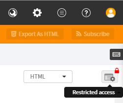
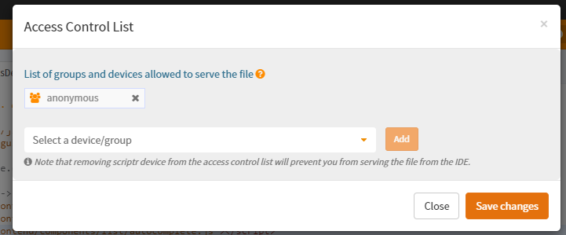
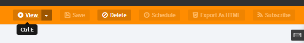
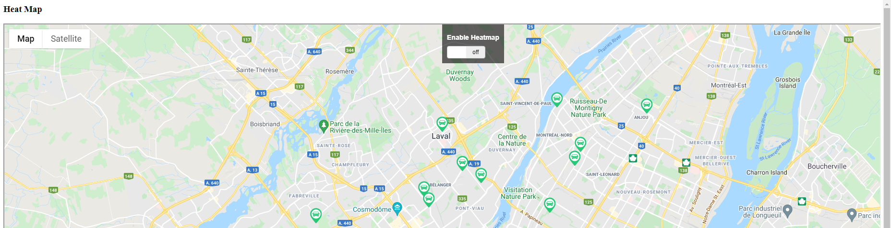
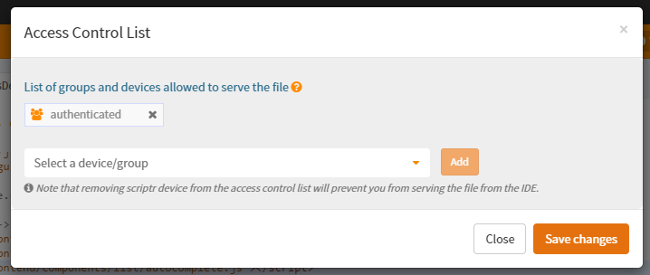
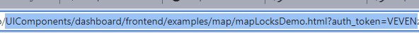

# How to embed a scriptr page into in any website

## Public pages

We can simply embed any public scriptr html script from scriptr into any website by using an iframe in the receiving page.

For this example i have chosen the page `UIComponents/dashboard/frontend/examples/map/mapLocksDemo.html`.

Open the script you wish to embed in the scriptr workspace and click on the **Access Control List** button in the top right of the html script. 



If the access rights are set to **anonymous** , that means the page is publicly available otherwise erase current list by pressing the **x** near user/authenticated then click on anonymous then press **Save Changes** 



To check that the page is accessible publicly point your browser to your **subdomain.scriptrapps.io/pageAddress** for example `embeddemo.scriptrapps.io/UIComponents/dashboard/frontend/examples/map/mapLocksDemo.html` , or you can click the view button.



You can also copy paste the URL in incognito/private mode to check it's accessible. Add an iframe to the target webpage with the source pointed at the chosen html script . In our example: 

```html
<iframe src="https://embeddemo.scriptrapps.io/UIComponents/dashboard/frontend/examples/map/mapLocksDemo.html" title="demo map" width="100%" height="100%"></iframe>
```




## Private Pages

Embedding a private (or page that requires authenticating) is similar to the method used above but we will need to pass the auth in the URL, for the sake of example let's consider the same source page we were using before. this time click on the **Access Control List**  remove **Anonymous** and select then add **Authenticated** 



**Save Changes** open map script in scriptr and press view to view it the same way we did previously. 

The URL in the browser will now have auth_token appended to it, copy the whole url with the token to your iframe to embed it. 



