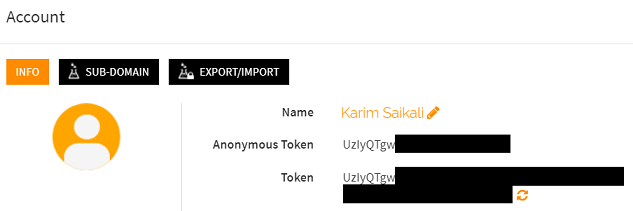
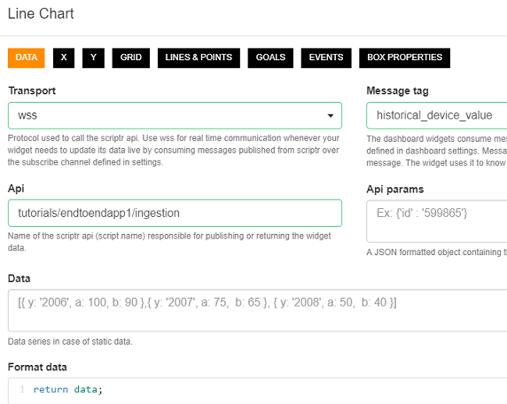

# About this tutorial

This is a short tutorial on how to implement a very simple end-to-end IoT application with scriptr.io, as means to start familiarizing yourself with our platform.

We will consider the following use case: we need to display in a very simple dashboard, the current and historical values of measurements (speed, temperature and number of passengers) sent by a device to our scriptr.io account through http POST requests. Value changes will be reflected in real-time in the dashboard.

Through the tutorial, you will become more familiar with programming applications with scriptr.io and notably:

- Exposing operations through an API
- Storing and persisting data into scriptr.io's NoSQL data store
- Broadcasting messages
- Building a dashboard using scriptr.io's dashboard builder

# The IoT application

## Application parts

Our application will be composed of two parts:
- A data ingestion script used by the device to send measurements. The script saves the data it receives in your scriptr.io account's  NoSQL data store and publishes updates to the dahsboard. The ingestion script runs on the cloud.
- A dahsboard script that receives published data and displays it. The dashboard is served by scriptr.io and runs on the browser.


To keep it simple, we will simulate the device by resorting to [Postman](https://www.getpostman.com/products), a well known http client. We will manually send data from Postman to our data ingestion script. However, if you have a device that you can program to issue http requests, feel free to use it.

## Required functionality

Our application requires the following functions to be implemented:

1. Extract the payload sent by the device from the received http request
2. Store the extracted payload (measurements) into the NoSQL data store
3. Query the data store for the historical values of each measurement
4. Publish the latest values and the historical values to the dashboard
5. Display the values in the dashboard

# Implementation

## Part 1: the ingestion script

In the following, we assume that the device sends us the following JSON payload via an HTTP POST request:
```
{
  "speed": <some_value>, // e.g. 45
  "temperature": <some_value_in_celsius>, // e.g. 25
  "num_passengers": <some_value> // e.g. 12
}
```

### 1. Extract the payload sent by the device

Let's go ahead and create our ingestion script. This is a server-side script, i.e. it runs on the cloud. To create a new (server-side) script from the [workspace](https://www.scrptr.io/workspace), click on the +New Script option in the bottom-left corner of the screen:

- Enter a name for your script (we will name it "ingestion" in this example)
- In the editor area, type "return" and save the script by clicking "Save" in the menu bar.


In scriptr.io, any (server-side) script you implement is automatically turned into a secure web service, remotely accessible via different protocols and notably http. After saving your script, you now have a remotely accessible API available at the following endpoint: https://api.scriptrapps.io/ingestion.

You might be wondering what would happen if all readers of this tutorial named their script "ingestion", wouldn't there be collisions? Actually, since scriptr.io turned your script into a **secure** web service (you might have noticed the small red lock in the right), devices can only invoke that script by sending requests along with credentials that are initially generated by your own scriptr.io account. Since credentials are account specific, there is no risk of collision! We'll get back to credentials later on.

Let's now add the code that retrieves the payload from the http request, to the "ingestion" script. All we need is to use the native **request** object and read the payload from the latter's **body** property:
```
var payload = request.body;
```
Save your changes by clicking "Save".

### 2. Store the extracted payload (measurements) into the NoSQL data store

Scriptr.io's data store is not a relational database. Instead of saving data in table rows, you save them into *documents*, which are key/value pairs. 

To manipulate documents, you need to use the document API (or module). To instruct your script to load an API (module), just use the **require** function as follows:
```
var document = require("document"); // add this line to the ingestion script
```
In the above instruction, we loaded the document API into a variable called "document". We can now leverage all the functions that are defined in our API through this variable ("document"). More particularly, to create a document using the received payload, just save the latter by using the **save** function of the document object.
```
document.save(payload);  // add this line to the ingestion script
```
That's all. Don't forget to save your changes.

### 3. Query the data store for the historical values of each measurement

While scriptr.io's data store is not a relational database, you still can build queries to retrieve your data, using a simple syntax that is rather close to SQL. 

Scriptr.io queries allow you to retrieve documents (or document excerpts) from your store, based on some criteria you provide. A query requires you to specify the following (at least):
- the query expression (filtering criteria)
- the fields to return from the document

So let's assume we want to obtain all documents that have a non null speed and temperature fields. We should accordingly create a new query object as follows:
```
// add the below to the ingestion script
var queryObj = {
  query: "temperature is not null and speed is not null", // this is the query expression
  fields: "temperature, speed, number_passsengers, creationDate" // this lists the fields we need to obtain
};
```
**Note**: you might have noticed that the "fields" property contains the "creationDate" field. This latter is not a field that the device sent. It is actually part of the metadata that is automatically added by scriptr.io. It indicates the date/time at which a document was created.

Executing queries on documents is also done using the document API, using the **query** function. Since we already loaded our API in the document variable, we can directly reuse it to run our query:
```
// add the below lines to the ingestion script
var resp = document.query(queryObj); // execute the query by passing the query object to the query function of the document API
var historicalData = resp.result.documents; // the returned documents list
```
**Note**: scriptr.io automatically limits to 50 the number of documents returned by a query.

Don't forget to save your changes.

### 4. Publish the latest and the historical values to the dashboard

Publishing - or broadcasting - data to anyone listening (this is refered to as "publish/subscribe") is a very practical mechanism that allows for the real-time propagation of data from one data source to one or many destinations. It is done in scriptr.io through **channels**. 

We will leverage the publish/subscribe ability of scriptr.io to propagate (i.e. *publish*) data from the server-side script to the dashboard, in real-time. Before we can publish anything to our dashboard, we first need to create a channel:

- Click your username in the top-right corner of the screen
- From the drop-down, select "settings"
- Click the "Channel" tab
- Add a new channel (name it "dashboardchannel" for this tutorial) then click the check sign


Any entity wishing to consume the messages that are published to a channel needs to subscribe to it. You can have one or many subscribers for the same channel. Thus, we have to subscribe our dashboard to the dashboardchannel we just created:
- From the dashboard editor, click the gear icon on the right side of the toolbar


- Set the value of the "Subscribe channel" field to "dashboardchannel". 
- Save you changes


Let's now get back to editing the "ingestion" script. We need to publish the new data to the dashboard (through the **dashboardchannel**). This is simply done using the native **publish** function that expects you to pass it the following properties:

- The name of the channel to publish to (e.g. dashboardchannel)
- An object containing the following fields:
  - "id": this can be any string you specify, which is used by a subsciber of the channel to determine that a published message is his
  - "result": this can be any value or object to publish towards subscribers

So let's go ahead and add the code to publish the payload that was just received by our "ingestion" script:
```
// add the below line to the ingestion script
publish("dashboardchannel", {"id": "latest_device_value", "result": payload});
```
Let's also add the code to publish the historical values we've just obtained from the execution of our request:
```
// add the below line to the ingestion script
publish("dashboardchannel", {"id": "historical_device_value", "result": historicalData});
```
Notice that we used different id values: "latest_device_value" and "historical_device_value", which allows the widgets of the dashboard to only consume messages they are interested in, as we will see it shortly.

Finally, let's return "historicalData" the variable that we created earlier that contains the result of the query. This is not necessary but we will use it to show you the structure of the data that is returned by a query.

## Let's run a first test

From the **Postman** user interface, we will issue a POST http request toward our ingestion script. Open Postman, create a new request of type POST and enter the address of your script.


From the Postman user interface, click the "Body" tab. Enter the following JSON structure:
```
{
  "speed": 45, 
  "temperature": 25, 
  "num_passengers": 12 
}
```
Make sure to check the "raw" rabio button and set the content type to JSON(application/json) using the drop-down on the right.


We also need to specify our credentials since, as already mentioned, our script is a secure web service. For now, we will use our scriptr.io account's main token. To get it, click your username in scriptr.io's [workspace](https://www.scrptr.io/workspace). Click "Account", then copy the value of the "Token" field.



From the Postman user interface, click the "Authorization" tab. From the "Type" drop-down, select "Bearer Token" and paste the value of your scriptr.io token into the corresponding field.


Send your request to your script by clicking the **Send** button. You should obtain a response similar to the below:


As you can see, the historical values query returns an array (list) of documents (a single one in that case since this is the first time we invoke our script). Also notice the "creationDate", "key" (document unique ID) and "versionNumber" fields that are automatically added by scriptr.io.
```
"result": [
 {
  "key": "8CDA3EA9AAE5587D113BBC9F9E5FB76D",
  "versionNumber": "1.0",
  "temperature": "25",
  "speed": "45",
  "num_passengers": "12",
  "creationDate": "2019-08-26T11:49:52+0000"
 }
]
```

## Part 2: the dashboard

In this simple example, we will not code anything on the User Interface side, but we will rather resort to the "Dahboard Builder", a visual tool provided by scriptr.io's web IDE to rapidly implement dashboards. A dashboard is merely an HTML/JavaScript page that is generated for you. It is thus served by scriptr.io but runs in the browser. 

To create a new dashboard, simply click the arrow near "+New Script" in the bottom left corner of the [workspace](https://www.scrptr.io/workspace) then select "Dashboard". 

### Displaying the latest values

To display current values of speed, temperature and number of passengers, we will respectively use 2 gauges and 1 odometer. Just click the corresponding icon in the dashboard's toolbar to add the widgets to the dashboard.


Let's customize our widgets a bit to fit our use case, by clicking the gear icon in the right corner of each widget. Let's start with the first gauge that will display the latest value of the speed:

- In the DATA tab, replace the value of the **Message tag** with the value specified for the **id** field of the message published to the channel. In our case, we used "latest_device_value". This means that our gauge will only consume published messages that have an id set to "latest_device_value".
- In the DATA tab, replace the code in the **Format data** field with the following:
```
return data.speed;
```
**data** contains the value that is received by the widget. Since the ingestion script is publishing the whole payload it received, we need to instruct the gauge widget to only read the value of the payload field it is interested in (the "speed"). This is why we have to replace ```return data``` with ```return data.speed```.


- In the MIN/MAX tab, replace the values of the **Gauge min** and **Gauge max** fields with values you find appropriate to represent the speed (let's say 0 to 150)


- In the BOX PROPERTIES tab, replace the value of the **Box Label** field with an appropriate title (e.g. "Speed")


Click the "Save" button to save you changes.

Proceed similarly with the other widgets (the gauge to display the temperature and the odometer to display the number of passengers).

- In the DATA tab, set the "message tag" field of the gauge and the odometer to "latest_device_value"
- In the DATA tab, set the "data" field of the gauge to ```return data.temperature``` and set the data field of the odometer to ```return data.num_passengers```. Also set the "static data" field of the latter to 0.
- In the MIN/MAX tab of the gauge, set the values of the **Gauge min** and **Gauge max** fields to 0 and 50 (or any other value)
- Change the title of the widgets using the BOX PROPERTIES tab.

Click the "Save" button to save you changes on the widget. *Also make sure to give a name to your dashboard and to save it. Saving changes on a Widget does not save the dashboard itself!*.

### Displaying the historical values

To display historical values we will resort to a "line chart". Just click the corresponding widget in the menu bar of the dashboard builder to add a line chart, which we will also customize to our needs.

To customize the line chart widget, click the gear icon on its top-right corner:

- In the DATA tab, set the "message tag" field to "historical_device_value". This means that our line chart will only consume published messages that have an id set to "historical_device_value".
- Replace the value of the "API" field with "ingestion". This instructs the widget to send a request to this script, the first time it is loaded. The widget will thus display any data that is returned by the script.
- Clear the content of the "DATA" field (this is optional)



- In the X tab, specify the value that will be used on the horizontal axis by changing the "X Key" field. In our case, we will use the value of the "creationDate" field that is returned for each document by our query.  
- Optionnally, you can specify the display angle of the values on the horizontal axis. In the below figure, we set this to an angle of 45 degrees.


- In the Y tab, specify the value that will be used on the vertical axis by changing the "Y Keys" field. In our case, we will use the "speed", "temperature" and "num_passengers" fields of the documents that are returned by the query and published to the dashboard. 
- Notice that you also can modify the labels that will respectively be diplayed for each field by the widget.


Click the "Save" button to save you changes on the widget. *Also make sure to save your dashboard*.
You should now have a dashboard that resembles the below:


## Open the dashboard in the browser

Before opening the dahboard in the browser, turn it into a secure dashboard, i.e. a page that can only display data to authenticated and authorized users. On that purpose, click the small green lock icon in the right corner of the screen:

- Remove "anonymous" (allows for non authenticated access) 
- Select "authenticated" (restrict access to users/devices of your account) from the drop-down. 
- Click "add" and confirm your choice with "Yes".
- Save your changes.


The green lock turns into red to indicate that the dashboard is now only accessible by authenticated users. Click **View** in the toolbar to open the dashboard in the browser.

## Let's try again

From Postman, click the "Send" button again. You should this that the value are automatically reflected on your dashboard. Try changing the values of speed, temperature and number of passengers and clicking "Send" every time to see how your dashboard will be updated.

# Read more

The different features seen throughout this tutorial are described in the following "how tos":

- [How to create a secure and scalable API?](https://github.com/scriptrdotio/howto/blob/master/api/create_api.md)
- [How to retrieve the parameters sent to my API via http?](https://github.com/scriptrdotio/howto/blob/master/api/read_http_request_parameters.md)
- [How to persist data?](https://github.com/scriptrdotio/howto/blob/master/data/persist_data.md)
- [How to retrieve my persisted data?](https://github.com/scriptrdotio/howto/blob/master/data/query_data.md)
- [How to obtain authentication tokens?](https://github.com/scriptrdotio/howto/blob/master/api/obtain_auth_token.md)
- [How to restrict access to my API?](https://github.com/scriptrdotio/howto/blob/master/acl/restrict_access_to_api.md)
- [How to display simple values in a dashboard?](https://github.com/scriptrdotio/howto/blob/master/ui/create_dashboard.md)
- [How to display historical data in a dashboard?](https://github.com/scriptrdotio/howto/blob/master/ui/create_dashboard_historical.md)
- [How to know what data structure is expected by a widget I add to my dashboard?](https://github.com/scriptrdotio/howto/blob/master/ui/what_data_structure_for_widget.md)
- [How to update my dashboard in real time?](https://github.com/scriptrdotio/howto/blob/master/ui/realtime_dashboard.md)
