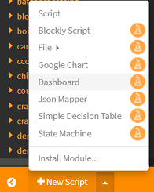

# How to create a simple dashboard my data?

- Open your [workspace](https://www.scriptr.io/workspace), then click on the arrow near "New Script" in the bottom left corner of the screen
- Select **Dashboard** to open the dashboard builder

The dashboard builder is a visual environment that allows your to build dashboards without coding.

## Displaying single values

The dashboard builder offers several widgets that are dedicated to displaying single values, such as gauges, speedometer or odometer.

Let's say you need a gauge to display the current temperature measured by a sensor and persisted in a document. This is done in three steps:
- Add a gauge to the editing area 
- Create an API script to read the temperature from the document (we assume you already created the script to persist the temperature in a document)
- Connect the gauge to the script

### Add a gauge to the editing area

- Click on the gauge icon in the toolbar. A new Gauge is automatically added to the dashboard

while some others are better at displaying historical data (line charts, bar charts, etc.)
