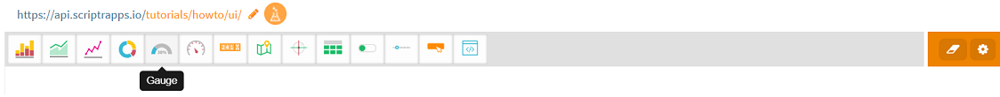
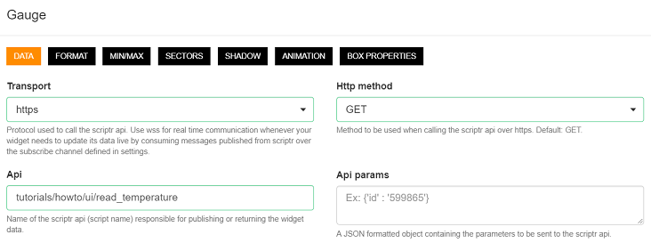

# How to display simple values in a dashboard?

- Open your [workspace](https://www.scriptr.io/workspace), then click on the arrow near "New Script" in the bottom left corner of the screen
- Select **Dashboard** to open the dashboard builder


*Image 1*

The dashboard builder is a visual environment that allows your to build dashboards without coding.

## Displaying single values

The dashboard builder offers several widgets that are dedicated to displaying single values, such as gauges, speedometer or odometer.
Say you need a gauge to display the current temperature measured by a sensor and persisted in a document. This is done in four steps:
- Add a gauge to the editing area and configure it 
- Create an API script to read the temperature from the document (we assume you already created the script to persist the temperature in a document)
- Connect the gauge to the script
- Save your dashboard and view it

### Add a gauge to the editing area and configure it 

- Click on the gauge icon in the toolbar. A new Gauge is automatically added to the dashboard



*Image 2*

- You can resize the gauge by dragging its bottom-right corner. You can also move the gauge by pressing on the gauge title bar then dragging and dropping it
- You can customize the look and feel of the gauge by clicking on the **gear icon** to open the settings


*Image 3*

Since we need to display temperature, we will configure the min and max values (in Celsius) and the corresponding colors: green from 0 to 22, orange from 23 to 28 and red from 29 to 40:

- From the setting, click on the Min/Max tab
- Set the min value to 0 and the max value to 40


*Image 4*

- From the setting, click on the Format tab
- Set the Symbol field to "Celsius"


*Image 5*

- From the setting, click on the Sectors tab
- By default, the gauge is subdivided in three sectors (ranges). Remove them by clicking on the 'x' sign to their right
- Click on the +Add button underneeth the Custom ranges section to create your own ranges
  - Select green color and set **lo** to 0 and **hi** to 22
- Repeat this for the other ranges, as shown in the figure below, then click on Save


*Image 6*

### Create an API script to read the temperature from a document 

In the [workspace](https://www.scriptr.io/workspace), click on "New Script" to create a new script and paste the below code in it, then save it 
```
var document = require("document");
var resp = document.get("current_readings"); // we assume we created "current_readings"
var temperature = Number(resp.result.temperature);
return temperature;
```

### Connect the gauge to the script

- From the gauge, click on the **gear icon** to open the settings
- In the Data tab:
  - Set the **Transport** field to https
  - Set the **Api** field to the absolute path of your script (**do not start with /** !)
  - Click on Save



*Image 7*

### Save your dashboard and view it

- Give a name to your your dashboard and save it by pressing Save in the workspace toolbar
- You now have a full fledge HTML dashboard that can be opened from any web browser 
- Try it by clicking on "View" in the workspace toolbar.

**ATTENTION** If you open your dashboard directly from a browser using it's URL (not from the workspace), do not forget to pass a valid script authentication token in the query string. Otherwise, the dahsboard will not be able to invoke the API that returns the temperate

```
// Example
https://iotdemos.scriptrapps.io/tutorials/howto/ui/gauge_dashboard?auth_token=UzByDTgkRjkk2NjpmaXRiaXQ6MjlBRURDOEZCMzlDOTR1QUE5MDIxQ0LyGjc7MkJ5MDU%6X
```
# More

- [How to persist data?](../data/persist_data.md)
- [How to retrieve my persisted data?](../data/query_data.md)
