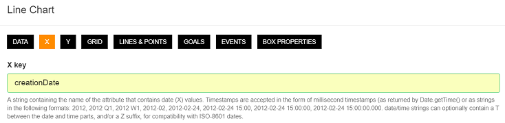

# How to display historical data in a dashboard?

- Open your [workspace](https://www.scriptr.io/workspace), then click on the arrow near "New Script" on the bottom left corner of the screen
- Select **Dashboard** to open the dashboard builder


*Image 1*

The dashboard builder is a visual environment that allows your to build dashboards without coding. It offers several widgets that are dedicated to displaying historical values, such as **[line charts](#Displaying-Historical-values-with-a-line-chart), bar charts or [Grids](#Displaying-historical-values-with-a-Grid)** This tutorial will explain how to use line charts and grids respectively.

## Displaying Historical values with a line chart

Say you need a line chart to display the historical variations of temperature and humidity measured by a sensors and persisted in documents. 
This is done in four steps:
- Add a line chart to the editing area and configure it 
- Create an API script to query the data store for historical values of temperature and humidity (we assume these documents exist)
- Connect the line chart to the API script
- Save your dashboard and view it

### Add a line chart to the editing area and configure it 

- Click on the line chart icon in the toolbar. A new lien chart is automatically added to the dashboard


*Image 2*

- You can resize the line chart by dragging its bottom-right corner. You can also move the line chart by pressing on the widget's title bar then dragging and dropping it
- You can customize the look and feel of the line chart by clicking on the **gear icon** to open the settings


*Image 3*

Since we need to display historical temperature and humidity values, we should configure both X (date/time) and Y (temperature, humidity) values axes,

- From the setting, click on the **X** tab
- Set the value of the X-Key field to a date/time field holding a timestamp in the documents (if you do not have a timestamp, you can choose "creationDate" that is automatically created by scriptr when creating a document)



*Image 4*

- From the setting, click on the **Y** tab
- Set the value of the Y-Keys field to an array containing the names of the documents fields that hold temperature and humidity values (assume these are "temperature and "humidity")
- Set the value of the Labels field to an array of label, for each of the above field name respectively


*Image 5*

### Create an API script to query the data store for historical values of temperature and humidity 

In the [workspace](https://www.scriptr.io/workspace), click on "New Script" to create a new script and paste the below code in it, then save it 
```
var document = require("document");
var queryParams = {
    query: "temperature<numeric> is not null and humidity<numeric> is not null",
    fields: "temperature, humidity"
};

var resp = document.query(queryParams);
if (resp.metadata.status == "success") {
    return resp.result.documents;
}

return [];
```

### Connect the line chart to the script

- From the line chart, click on the **gear icon** to open the settings
- In the Data tab:
  - Set the **Transport** field to https
  - Set the **Api** field to the absolute path of your script (**do not start with /** !)
  - Clear the **Data** field
  - Click on Save


*Image 6*

### Save your dashboard and view it

- Give a name to your your dashboard and save it by pressing Save in the workspace toolbar
- You now have a full fledge HTML dashboard that can be opened from any web browser 
- Try it by clicking on "View" in the workspace toolbar.

**ATTENTION** If you open your dashboard directly from a browser using it's URL (not from the workspace), do not forget to pass a valid script authentication token in the query string. Otherwise, the dahsboard will not be able to invoke the API that returns the temperature and humidity values

```
// Example
https://iotdemos.scriptrapps.io/tutorials/howto/ui/linechart_dashboard?auth_token=UzByDTgkRjkk2NjpmaXRiaXQ6MjlBRURDOEZCMzlDOTR1QUE5MDIxQ0LyGjc7MkJ5MDU%6X
```

## Displaying historical values with a Grid

If you need a tabular representation of your historical data, a grid is a more appropriate choice. As it is the case for the line chart, we wil do this in four steps:

- Add a grid to the editing area and configure it 
- Create an API script to query the data store for historical values of temperature, humidity and creation date (we assume these documents exist)
- Connect the grid to the API script
- Save your dashboard and view it

### Add a grid to the editing area and configure it 

- Click on the grid icon in the toolbar. A new grid is automatically added to the dashboard


*Image 7*

- You can resize the grid by dragging its bottom-right corner. You can also move it by pressing on the widget's title bar then dragging and dropping it
- You can customize the look and feel of the grid by clicking on the **gear icon** to open the settings


*Image 8*

Since we need to display historical temperature, humidity and creation data values, we will create three columns in our grid and for each column, specify the label and the name of the field to retrive the data from. This field will be found in the data object returned by a call to the API script, as we will see it soon.


*Image 9*

### Create an API script to query the data store for historical values of temperature and humidity 

Although we are querying the same value from the data store as in the case of the line chart, we cannot reuse the code as-is, due to the specific behavior of the grid widget. Indeed, grids support pagination and lazy loading, therefore they expect the data object they receive from the API to contain the "count" field. The latter indicates the total count of documents that can be retrieved from the data store (based on the query).

Hence, scrolling down in the Grid or clicking a "next" arrow (when available) automatically triggers a request towards your API. This request sends two parameters: "pageNumber" and "resultsPerPage", which instruct your API about the page to return and the number or records to return.

In the [workspace](https://www.scriptr.io/workspace), click on "New Script" to create a new script and paste the below code in it, then save it: 

```
// PageNumber and resultsPerPage will be sent automatically by the grid when paginating/lazy loading
var pageNumber = request.parameters.pageNumber; 
var resultsPerPage = request.parameters.resultsPerPage;

var document = require("document");

// Provide pageNumber, resultsPerPage and count to your Query
var queryParams = {
    query: "temperature<numeric> is not null and humidity<numeric> is not null", // query expression (example)
    fields: "temperature, humidity, creationDate", // fields to return from the resulting documents (example)
    count: true, // set this to true to get the total count of documents matching the query expression
    pageNumber: pageNumber, // pass this for pagination
    resultsPerPage: resultsPerPage // pass this for pagination
};

var resp = document.query(queryParams);
if (resp.metadata.status == "success") {
    return resp.result; // return resp.result which will include "documents" (array of documents) and "count"
}
// if failure, return empty array and 0 count
return {
    documents: [],
    count: 0
};
```

### Connect the grid to the script

- On the grid widget, click on the **gear icon** to open the settings
- In the Data tab:
  - Set the **Transport** field to https
  - Set the **Api** field to the absolute path of your script (**do not start with /** !)
  - Clear the **Data** field
  - Click on Save


*Image 10*

### Save your dashboard and view it

- If not already done, give a name to your your dashboard. Save it by pressing Save in the workspace toolbar
- Try it by clicking on "View" in the workspace toolbar.

**ATTENTION** If you open your dashboard directly from a browser using it's URL (not from the workspace), do not forget to pass a valid script authentication token in the query string. Otherwise, the dahsboard will not be able to invoke the API that returns the temperate

# More 
- [How to persist data?](../data/persist_data.md)
- [How to retrieve my persisted data?](../data/query_data.md)
