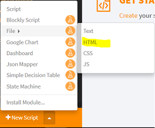
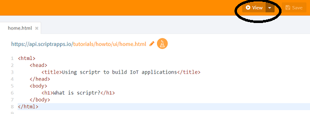
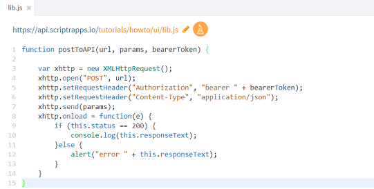
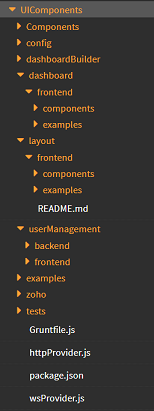

# How to create web user interfaces (HTML/JavaScript)?

If you want more than a dashboard, scriptr allows you to implement your own web user interfaces. Once saved, your HTML pages and JavaScript scripts will be hosted and served by your scriptr account! If you do not wish to start from scratch, you can also deploy our [UI component library](https://github.com/scriptrdotio/UIComponents).

## Create an HTML page

- Open your [workspace](https://www.scriptr.io/workspace)
- Click on the arrow near the **+New Script** option on the bottom left corner of the screen
- Select **File** then **HTML**

*Image 1*

Once your are done typing your HTM/Javascript code, click on **Save** to save your script and deploy it on the cloud environment (it is recommended to add the .html extension at the end). You can open your HTML page in a browser by clicking on **View**

*Image 2*

**Note**: clicking on the drop-down arrown next to **View** opens a form that allows you to specify parameters that will be sent to your HTML page as part of the request

## Create a client-side JavaScript script

- Open your [workspace](https://www.scriptr.io/workspace)
- Click on the arrow near the **+New Script** option on the bottom left corner of the screen
- Select **File** then **JS**

**Note**: we recommand using the ".js" extension to client-side scripts

*Image 3*

**IMPORTANT**: obviously, you cannot directly invoke a server-side script from a client-side script. You will have to issue a request for that, using http or websockets, from the latter to the former.

## Leverage the UI Components library

If you do not wish to start from scratch, you can resort to our UI Component library. Although it built with AngularJS, you can start using it without any knowledge of the latter.

### Deploy the UI Component library

- Make sure to [configure Github for your scriptr account](https://github.com/scriptrdotio/howto/blob/master/teamwork/version_control.md)
- Click on the arrown near +New Script on the bottom-left corner of the screen and select **Install module**
- Click on **Add Custom Module from GitHub** 
- Fill the fields of the Modules dialog as follow:
  - Owner: scriptrdotio
  - Repository: UIComponents
  - Path: set to /UIComponent if you need all the components
  - Branch: leave empty (master by default)
  - Destination folder: the path in your workspace where to deploy the content of the repository. Entering "UIComponents" will deploy the library in the root folder
- Click Install once done.

Check the layout and usermanagement folders and notably their **examples** sub-folders respectively for creating menu bars and login pages.

*Image 4*

### Configure the UI Component library

You just need to modify the **/UIComponents/config/scriptrTransport.js** script as follows:

- In **wsClientProvider.setToken()** and **httpClientProvider.setToken()** and pass a valid authentication token
  - For more on how to obtain token, read [this](https://github.com/scriptrdotio/howto/blob/master/api/obtain_auth_token.md)
- In **httpClientProvider.setBaseUrl()** pass your accounts endpoint using your sub-domain (e.g. myiot.scriptrapps.io)
  - For more on how to create a sub-domain, read [this](https://github.com/scriptrdotio/howto/blob/master/config/create_subdomain.md)
