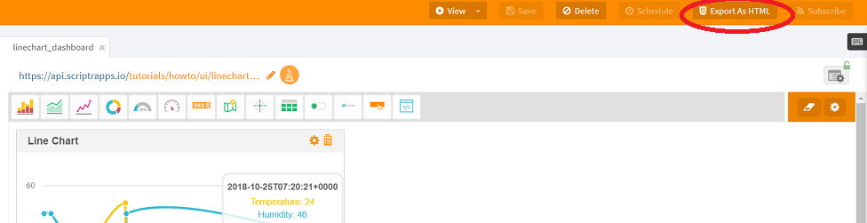
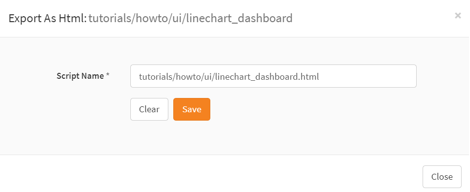

# How to customize a dashboard?

In [How to display simple values in a dashboard?](./create_dashboard.md) and [How to display historical data in a dashboard?](./create_dashboard_historical.md) you've learned how to create a dashboard using the dashboard builder.
We will see now how you can customize a dashboard to incorporate your own HTML and JavaScript.

That's simple to do,

Open your [workspace](https://www.scriptr.io/workspace), browse through the tree list view on the left of the screen to locate your dashboard and open it.
Once the dashboard is loaded, click on the **Export as HTML** button in the toolbar

*Image 1*

In the dialog that opens, enter a name for your dashboard or keep the default one, then click on **Save**

*Image 2*

A new HTML/JavaScript script is added to your [workspace](https://www.scriptr.io/workspace) and automatically opended in the editor
You can now customize its content by adding HTML, CSS and/or JavaScript.
