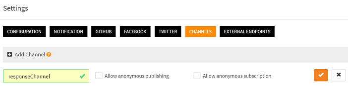
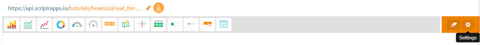
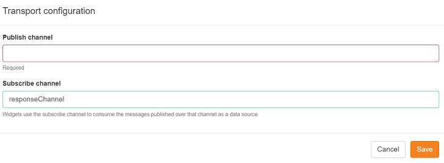
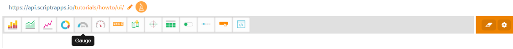
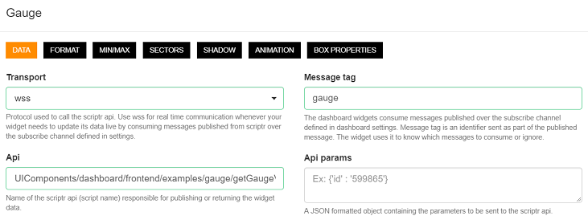

# How to update my dashboard in real time?

You have devices that are pushing data to one of your API and you need to reflect the data in real time on a dasboard. 
This is easily done, by following the below steps:

- Create a channel
- Create a dashboard and subscribe it to the channel
- Add a widget to reflect the values
- Bind the widget to the channel
- Update you API (or create a new API) that receives the data to publish to the dashboard

## Create a channel

A channel is a generic publish/subscribe mecanism. Scripts or remote clients can publish or subscribe to it using any of the supported messaging protocols (websockets, mqtt, amqp). Any published messages is automatically broadcast to all subscribers.

To create a channel:

- Open your [workspace](https://www.scriptr.io/workspace), then click on your username in the top-right corner of the screen and select **Settings**
- Select the **Channels** tab then click "+Add Channel"
- Enter a name for your channel. Do not check the boxes if you do not want to authorize non authenticated (anonymous) subscriptions or publications

*Image 1*

## Create a dashboard and subscribe it to the channel

- Open your [workspace](https://www.scriptr.io/workspace), then click on the arrow near "New Script" in the bottom left corner of the screen
- Select **Dashboard** to open the dashboard builder (The dashboard builder is a visual environment that allows your to build dashboards without coding)

*Image 2*

- Click on the gear icon on the top right corner of the dashboard to open the settings

*Image 3*

- Enter the name of the channel created above in the **Subscribe Channel** field, then save. Doing so subscribes the dashboard to the channel and therefore, any message published to the latter will be broadcast to the dashboard automatically

*Image 4*

## Add a widget to reflect the values

Let's assume you will use a gauge to reflect real time temperature variations:

- Click on the gauge icon in the toolbar. A new Gauge is automatically added to the dashboard

*Image 5*

## Bind the widget to the channel

- Click on the gear icon on the top right corner of the gauge to open the settings
- Make sure that the **Transport** field is set to **wss** (secure websockets)
- In the **Message tag** field, enter an tag name that allows the gauge to only receive the messages that are intented to it. Indeed, since a dashboard can contain many widgets, multiple different messages can be broadcast to it, targeting different widgets. Therefore, each widget needs to specify a filter

# More

- [How to create a secure and scalable API?](../api/create_api.md)
- [How to retrieve the parameters sent to my API via http?](../api/read_http_request_parameters.md)
- [How to publish an mqtt message to a script (API)?](https://github.com/scriptrdotio/howto/blob/master/api/publish_mqtt_msgs_to_script.md)
- [How to read the messages sent to my API through mqtt?](https://github.com/scriptrdotio/howto/blob/master/api/read_mqtt_messages.md)
- [How to display simple values in a dashboard?](../ui/create_dashboard.md)
- [How to display historical data in a dashboard?](../ui/create_dashboard_historical.md)
