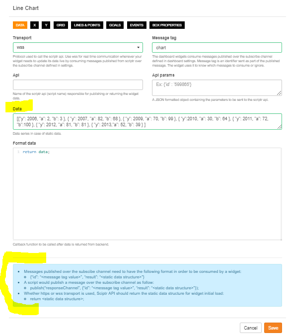

# How to know what data structure is expected by a widget I add to my dashboard?

- Click on the gear icon on the top right corner of your widget to open the settings
- Check the **Data** field. It contains a generic example of the data structure expected by your widget. 
You will probably have to change field names to match your own specific case
- If you are updating your widget in real time, check the blue section at the end of the settings dialog. 
It describes the structure of mesage to broadcast to your widget

Example

*Image 1*

# More

- [How to display simple values in a dashboard?](./create_dashboard.md)
- [How to display historical data in a dashboard?](./create_dashboard_historical.md)
- [How to update my dashboard in real time?](./realtime_dashboard.md)
