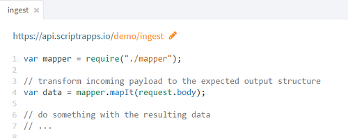
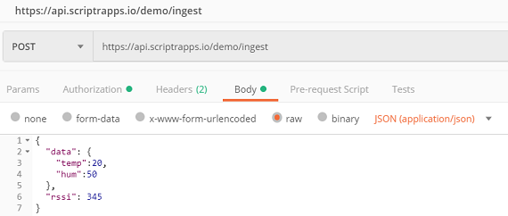

# How to transform an incoming JSON payload into another JSON structure (JSON mapper)?

In many cases your IoT application will be receiving JSON data in different structures because they are stemming from different data sources. 
You will therefore need to normalize these data into a unique target data structure that your business logic will use.

One option to transform an incoming JSON structure into another one is to code the transformation yourself in one of your scriptrs. 
Another interesting option is to do this visually, using the JSON mapper tool.

# The JSON mapper

Click +New Script in the bottom left corner of the [workspace](https://www.scriptr.io/workspace) and select Json Mapper.


*Image 1 - Open the Json Mapper*

## Define the Input data structure and the Output (target) data structure

In the editor area, under the **JSON** tab, enter a sample of the expected incoming payload structure in the **Input JSON** area. 
In our example, we will use the below:
```
{
  "data": {
    "temp":22,
    "hum":56
  },
  "rssi": 324
}
```
Assume we need to normalize this struture into the following target structure:
```
{
  "temperature":33,
  "humidity":56,
  "rssi": 324
}
```
Just type the target data structure into the **Output JSON** area.


*Image 2 - Enter Input and Output payloads*

## Visually map input fields to output fields

Click now the **Graph** tab to visually map the fields of the Input payload to those of the Output payload. Simply click a input field and drag the arrow to the corresponding output field.


*Image 3 - Map input fields to output fields by dragging the input to the corresponding output*

## Customize the mapping by adding transformation logic

Notice the **Transform data** section that appears on the right of the editor when you select any of the mapping rows: it allows you to customize the corresponding transformation.

Say for example that the temp field of the input payload contains a temperature value in Celsius degrees and that you would like to convert it to Fahrenheit degrees in the target payload. Just select the arrow binding the input temp field to the output temperature field and modify the Transform data section by entering the Celsisu to Fahrenheit conversion formula, as in the below:


*Image 4 - Customize the mapping by adding some transformation logic*

## Save your mapping

Save your mapping logic by entering a name and clicking **Save**. In our example, our script is name "demo/mapper".


*Image 5 - Enter a name for your mapping and save it*

If you click the **View script** tab, you will notice that scriptr.io has automatically generated the mapping logic for you. What is interesting is that you can now require this script from any of your other scripts and invoke the mapIt function, passing it a payload matching the defined Input data structure and obtain the expected Output in return. 

## Use the mapping to transform incoming data

Let's create an API script and call it "demo/ingest". It will be invoked by devices sending data payloads via an HTTP POST  request. The payload has the structured defined in the Input JSON aread of our example above. We will use our mapper to automatically transform this payload into the expected normalized form defined as Output JSON in our example: 

- Simple require the mapping script (in our example demo/mapper)
- Pass the received payload (obtained from the native request.object

```
var mapper = require("./mapper");

// transform incoming payload to the expected output structure
var data = mapper.mapIt(request.body); 

// do something with the resulting data 
// ...

```


*Image 6 - Use your mapping script from within any other script*

To try your mapping, open [Postman](https://www.getpostman.com/) to simulate the device that is sending requests to your demo/ingest API. Create a POST request pointing to your API and send a JSON payload (don't forget pass your scriptr.io authentication token in the Authorization header).



*Image 7 - Simulate the device that is sending the Input JSON payload to your API*


