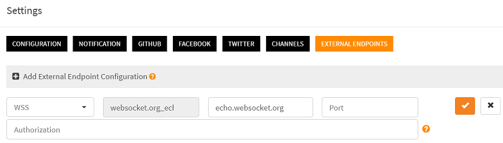
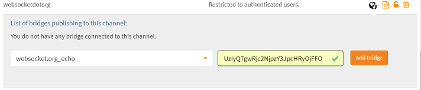
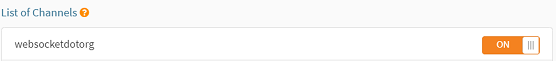

# How to communicate with a remote websocket endpoint?

Scriptr allows you to send messages to and receive messages from a websocket endpoint. It is important to note that sending and receiving cannot be done from th same script. Therefore, you will usually use one or many scripts to send messages to the endpoint and you  subscribe one or many scripts to receive messages from the websocket endpoint. When multiple scripts are subscribed to the same websocket endpoint, any message sent my the latter will be broadcast to all the subscribed scripts.

First steps before sending and receiving messages are to create a websocket endpoint and a websocket bridge.

## Create a websocket endpoint

From the [workspace](https://www.scriptr.io/workspace), click on your username on the top right corner of the screen. Select **Settings** then click on the **External endpoints** tab.
Click on **+Add** to create a new websocket endpoint:

- In the **Type** field, select WS or WSS (depending on the endpoint)
- In the **Name** field, enter a name for your endpoint 
- In the **URL** field, enter the URL of the endpoint
- In the **Port** field, enter the port. This is optional, only enter a value if the endpoint is not using nominal websocket ports
- In the **Authorization**, enter optional credentials



*Image 1*

Click on the orange checkbox on the right to create the endpoint. 

## Create a channel

If you did not create a channel before, follow the steps below, **otherwise, jump to the Create a bridge section**.

A channel is a generic publish/subscribe mecanism. Scripts or remote clients can publish or subscribe to it using any of the supported messaging protocols (websockets, mqtt, amqp). Any published messages is automatically broadcast to all subscribers.
To create a channel:

- In the [workspace](https://www.scriptr.io/workspace), click on your username in the top-right corner of the screen and select **Settings**
- Click on the **Channels** tab then click "+Add Channel"
- Enter a name for your channel. Do not check the boxes if you do not want to authorize non authenticated (anonymous) subscriptions or publications

## Create a bridge between the channel and the endpoint

A bridge connects a scriptr **channel** to an **endpoint**. 

- In the [workspace](https://www.scriptr.io/workspace), click on your username in the top-right corner of the screen and select **Settings**
- Click on the **Channels** tab then select one of your existing channels
- Click on the **globe icon** to manage the bridges for this channel
- Select the endpoint configuration to use
- Specify an authentication token to use when conveying a message from the endpoint to your scripts (if needed, [read how to create devices and users](https://github.com/scriptrdotio/howto/blob/master/acl/create_devices_users.md) to obtain a authentication token)
- Click on Add Bridge



*Image 2*

## Sending a message to a websocket endpoint

Sending messages is done using the native **publish()** function or using the **pubsub** module. In this example, we use the latter:
- Require the pubsub module
- Create an instance of the websocket channel from pubsub.getInstance()
- Invoke the publish() method of the channel instance, passing your message

```
var pubsub = require("pubsub");
var wschannel = pubsub.getInstance("websocketdotorg");
return wschannel.publish({"temperature":22, humidity:43}); //you can send json or text
```
## Receiving messages from a websocket endpoint

All you need to do is to subscribe a script to the corresponding channel. This can be done in two different ways:

- From the user interface
- From the code of another script

### Subcribe a script to a channel from the user interface

- In the [workspace](https://www.scriptr.io/workspace), select the script you wish to subscribe to the channel, from the tree view on the left side of the screen
- In the editor area, click on the **Subscribe button**
- Subscribe to a channel by switching on the corresponding toggle



*Image 3*

### Subcribing a script to a channel from the code of anoher script

Simply use the native **subscribe()** function in the code, passing the channel name and the absolute path to the script (**note**: do not start with "/")

```
// the below subscribed the "tutorials/howto/websockets/subscriber" to the "websocketdotorg" channel
var resp = subscribe("websocketdotorg", "tutorials/howto/websockets/subscriber");
```
