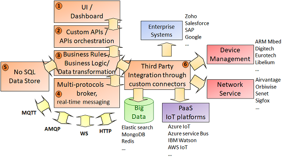
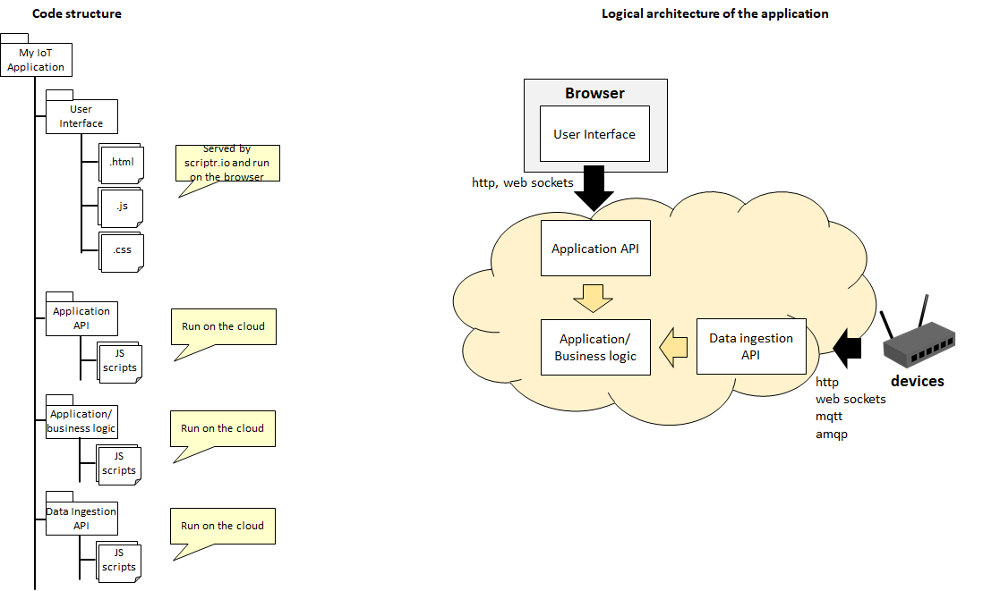

# What is scriptr.io?

In a few words: 

- Scriptr.io is a cloud-based platform for developing and executing Enterprise-scale IoT solutions. It offers a set of tools, components and APIs to reduce the effort and time to market IoT applications
- Everything you code is automatically deployed in a secure and scalable cloud environment, releaving you from devops operations
- Scriptr.io is a managed service, so we take care of monitoring the health of your applications
- Scriptr.io runs on the cloud, and upon request: on premise (data centers) and even at the Edge
- Scriptr.io is an extremely flexible and efficient IoT Middleware and communication broker, enabling collaboration among heterogenous platforms and protocols.

(1): Build dashboards by drag and dropping widgets using the Dashboard builder, or more advanced User Interfaces with scriptr.io's UI Component library

(2): Create your own custom API and API operations. Orchestrate your API operations and third party API operation using scriptr.io's orchestration service

(3): Implement any business logic and business rules in server-side JavaScript 

(4): Enable seamless message-based and real-time communication among heterogenous systems using different protocols by using scripr.io's brokering service

(5): Persist your application's data in scriptr.io's out-of-the-box NoSQL data store

(6): Integrate your business logic with 3rd party systems and APIs using scriptr.io's custom connectors

## How do I use it?

- You can [sign-up for a free account](https://www.scriptr.io/register) to start exploring scriptr.io
- Once registered, [sign-in](https://www.scriptr.io/login) and you will land in the [workspace](https://www.scriptr.io/workspace)
- The workspace is a web IDE that offers everything you need to start developing a full fledged IoT application 

## What language is used for coding?

- Scripts are the main constructs in script. Whenever you click on **+New Script** in the [workspace](https://www.scriptr.io/workspace), you create a new **server-side** script. Coding scripts is done in **JavaScript** and your logic will leverage scriptr.io's APIs.
- From a server-side script, you have access to an extensive list of scriptr.io modules, native objects and functions that offer powerful features. Since scripts are running on the server-side, **you do not have access to the DOM**
- It is also possible to create client-side HTML pages and JavaScript scripts. You can read more about this in the howto

## How and where is my code deployed?

As soon as you save a script in the Web IDE, it is automatically deployed on the cloud run-time and ready to be used.

## Can I use my own IDE?

Yes. The only constraint is to code your back-end scripts in JavaScript using scriptr.io's APIs and to code your front-end logic in standard JavaScript/HTML/CSS adding any third party libraries. You will need to send all your scripts to your scriptr.io account before running your application. The simplest way to do that is to commit your code to a Github repository to which your scriptr.io account is associated and that has [automatic deployment](https://www.scriptr.io/documentation#documentation-AutomaticDeployment) enabled. To run your scripts, the easiest way is to do it from scriptr.io's web IDE.

## What are the components of a typical application running on scriptr.io?

You can develop applications of various types using scritpr.io. However, a typical IoT application will consist of the following:
- One or many back-end scripts that receive http requests, mqtt, amqp or websocket messages sent by devices. This set of scripts constitute the data ingestion API. Back-end scripts are written in JavaScript and leverage scriptr.io's API. They run on the back-end (the cloud)
- One or many back-end scripts that implement any business/application logic. Back-end scripts are written in JavaScript and leverage scriptr.io's API. They run on the back-end (cloud)
- One or many User Interface scripts. They are coded in JavaScript/HTML5/CSS. They are served by scriptr.io and run on the browser
- One or many scripts that receive http requests and/or websocket messages from the User Interface to enable interactions between the end user and the application logic. This set of scripts constitutes the application API.

In addition to these layers, you can add integrations with third party systems and platforms, leveraging scriptr.io's bridges and connectors.

## What can I do with scriptr.io?

- Create APIs that can be invoked by remote clients (such as devices) over http, websockets, mqtt or amqp
- Implement application and business logic into reusable modules
- Invoke remote http REST APIs
- Persist data and files in a NoSQL data store
- Publish mqtt messages to remote mqtt topics
- Subscribe to remote mqtt topics
- Send amqp messages to remote amqp exchanges/queues
- Subscribe to remote amqp queues and exchanges
- Create scheduled (cron) jobs 
- Broadcast messages
- Queue the execution of tasks
- Integrate with Big Data platforms using connectors
- Integrate with networks services and device management platform using connectors
- Integrate with legacy systems using connectors
- Broker messages among different protocols in real-time
- Create HTML/JavaScript user interfaces
- Create HTML/JavaScript dashboards
- **... and much more**

## How to integrate with third party systems?

There are many ways to do this:
- Leverage our **bridges** to subscribe to remote topics and queues (mqtt, amqp, websockets, Azure IoT hub, AWS, Everyware, etc.)
- Leverage our [connectors](https://github.com/scriptrdotio?tab=repositories)

## Do I need to write my application from scratch?

No, a major component of scriptr.io is its market of vertical applications. We offer many [domain-oriented applications](https://github.com/scriptrdotio) (smart-water, smart-farming, asset monitoring, etc.) that you can customize and/or extend to your own requirements.

[Back to the how to list](https://github.com/scriptrdotio/howto/blob/master/README.md)
